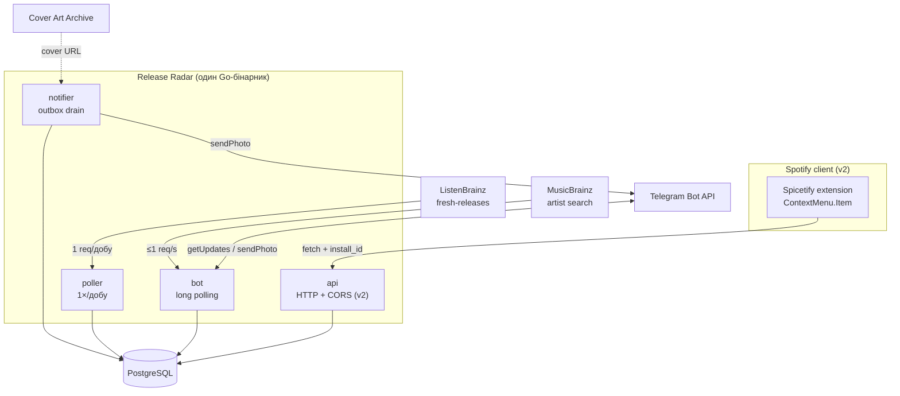
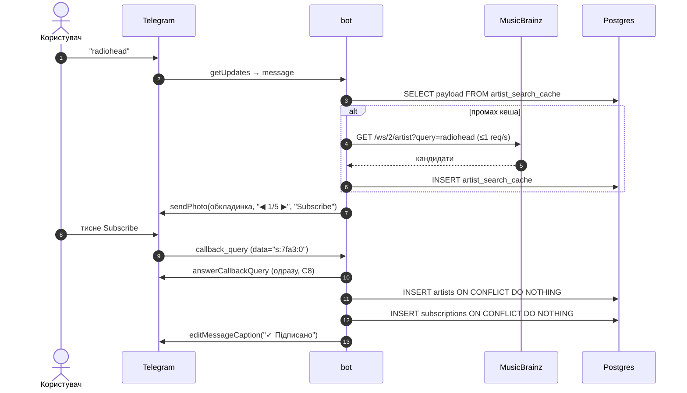

# Release Radar — специфікація

> Telegram-бот, що повідомляє про нові релізи артистів, на які підписався користувач.
> Мова: **Go**. БД: **PostgreSQL**. Джерело релізів: **ListenBrainz / MusicBrainz**.
> Статус: pre-code. Зафіксовано після research-раунду 19.08.2026.

Цей документ — джерело правди для проєкту. Кожне «чому саме так» тут записане навмисне:
більшість обмежень нижче були знайдені емпірично, і без них легко зробити рішення,
яке впаде через два тижні.

---

## 1. Зафіксовані рішення

| # | Рішення | Обґрунтування |
|---|---|---|
| D1 | Мова — **Go** | Задача = паралельні HTTP-виклики + планувальник + консьюмер черги. Sweet spot для горутин і `context`. Плюс цільова роль — junior backend |
| D2 | Джерело релізів — **ListenBrainz Fresh Releases** (чистий, без Spotify API) | Один запит на добу покриває всю екосистему замість N запитів на N артистів. **Точне формулювання:** константна лише кількість *зовнішніх* запитів (1/добу незалежно від того, 10 артистів у базі чи 10 000); локальний матчинг і fan-out в outbox зростають — з кількістю артистів у відповіді та з кількістю підписників на зматчений реліз відповідно. Ці зростання лінійні й дешеві (SQL, без сітки), але вони існують. Spotify Web API недоступний: **потрібен активний Premium власника app** (з лют. 2026), якого немає і не буде |
| D3 | Типи релізів — **album + single + EP** | Компроміс між покриттям і шумом. `appears_on` / `compilation` виключені |
| D4 | Порядок розробки — **бот у v1, Spicetify extension у v2** | Extension — єдина частина, яка ламається без участі автора. Не має бути в критичному шляху до працюючого продукту |
| D5 | Affordance в extension — **`Spicetify.ContextMenu.Item`**, не кнопка в хедері | Офіційний типізований API з URI-предикатом. Нуль DOM-хаків. Сам Spicetify пройшов цей шлях і відмовився від інжекту в хедер у 2019 |
| D6 | Лінкування Telegram — **deep link + обов'язковий код-fallback** | `?start=` payload ненадійно доходить для повторного лінкування (див. C4) |
| D7 | Ключ дедуплікації релізу — **`release_group_mbid`** | MusicBrainz release-*group* вже об'єднує всі видання одного альбому. Це структурно краще за Spotify `album.id`, який плодить регіональні дублі |
| D8 | Черга — **Postgres `SELECT … FOR UPDATE SKIP LOCKED`** (не RabbitMQ у v1) | Обсяг — сотні повідомлень/добу. Брокер додає ops-навантаження без виграшу. Див. Q-OPEN-1 |
| D9 | Redis — **немає** | Кешування перед перевіркою дедуплікації створює race condition і жодного виграшу не дає. Див. §8 |
| D10 | Telegram-бібліотека — **`mymmrac/telego`** | Bot API 10.2, єдина з вбудованою обробкою 429. `go-telegram-bot-api` (6.4k ★) мертва — останній коміт жовт. 2022 |
| D11 | `parse_mode` — **HTML** | MarkdownV2 вимагає екранування 18 символів за трьома контекстними правилами. У Go stdlib є `html.EscapeString`. MarkdownV2 гарантовано вб'ється на «Panic! At The Disco» |
| D12 | Отримання апдейтів — **long polling** | Telegram сам радить: *«You use getUpdates … keep it that way»*. Працює за NAT, без домену й TLS |
| D13 | **Канал доставки — плагін, не хардкод.** Таблиця `channels` + інтерфейс `Notifier` з першого коміту, навіть якщо реалізований лише Telegram | Дешево зараз, дорого потім. Email додається за вечір замість переписування домену. Обов'язкова умова: Telegram-специфічні типи (`chat_id`, `parse_mode`, `retry_after`) **не течуть** вище межі `Notifier` — домен каже «сповісти користувача U про реліз R» |
| D14 | **`cover_url` збирається `poller`-ом із полів відповіді, без жодного HTTP-виклику** | `caa_id` + `caa_release_mbid` уже є в payload (C27). Резолв у `notifier` дав би N запитів на N підписників; тут їх нуль. Заповнюється один раз при створенні релізу |
| D15 | **Вікно полінгу — `days=7&past=true&future=false`** при добовому інтервалі | Три причини тримати зворотне вікно ширшим за інтервал: (1) **пропущені полінги** — рестарт VPS, деплой, збій мережі; бекфілу немає, тож при `days=1` дводенний простій губить релізи безповоротно; (2) **лаг краудсорсингу** — `days` фільтрує за `release_date`, не за датою внесення (C24c), тому реліз від понеділка, внесений волонтером у середу, при вузькому вікні не з'явиться **ніколи**; (3) **перекриття безкоштовне** — `ON CONFLICT (release_group_mbid) DO NOTHING` робить повторне бачення релізу no-op. `future=false` прибирає майбутні релізи на джерелі й спрощує FR-2.5 |

**Незафіксоване** → §12 Open questions.

---

## 2. Функціональні вимоги

### FR-1 — Підписка через бота (v1)
- FR-1.1 `/start` без payload → вітання + інструкція.
- FR-1.2 `/search <name>` або просто текст → пошук артиста в MusicBrainz, показ до 5 кандидатів.
- FR-1.3 Кандидати показуються **однією карткою з пагінацією** (`sendPhoto` + `editMessageMedia`, `◀ 2/5 ▶` + `Subscribe`), а не 5 окремими повідомленнями.
- FR-1.4 Натискання `Subscribe` → створення підписки. Повторне натискання — no-op, не помилка.
- FR-1.5 `/list` → список підписок з кнопкою `Unsubscribe` біля кожної.
- FR-1.6 `/stop` → видалення всіх підписок і даних користувача.
- FR-1.7 Команди зареєстровані через `setMyCommands` (видимі в меню).

### FR-2 — Детекція релізів
- FR-2.1 Раз на добу опитувати `GET https://api.listenbrainz.org/1/explore/fresh-releases/?days=7&past=true&future=false`.
  **Не `days=3`, і не без `past`/`future`** — див. C24 і D15.
- FR-2.2 Матчити `artist_mbids` з відповіді проти множини відстежуваних MBID **локально** (сервер-сайд фільтра за артистом немає).
- FR-2.3 Фільтрувати за `release_group_primary_type ∈ {Album, Single, EP}`.
- FR-2.4 Новий реліз → запис у `releases` (разом із **одноразовим** резолвом `cover_url` через Cover Art Archive, див. D14); для кожного підписаного користувача → запис у `notifications`.
- FR-2.5 `future=false` відсікає майбутні релізи **на джерелі**, тому механіку «тримати `pending` до дати» будувати не потрібно:
  реліз природно підхопиться зворотним вікном, коли його дата настане. Перевірка `release_date > today`
  залишається як **захисний assert** (дешево, і API може змінитись), а не як несуча логіка.

### FR-3 — Доставка
- FR-3.1 Повідомлення містить: назву релізу, артиста, тип, дату, обкладинку (Cover Art Archive), посилання.
- FR-3.2 Темп надсилання дотримує лімітів Telegram (C3).
- FR-3.3 Транзієнтні помилки — retry з backoff. Постійні — видалення підписки (C5).
- FR-3.4 Один користувач отримує **рівно одне** повідомлення про один реліз, незалежно від того, скількома шляхами він підписався.

### FR-4 — Spicetify extension (v2)
- FR-4.1 Пункт контекстного меню на артисті: `Notify me about releases`.
- FR-4.2 Якщо користувач уже підписаний — показується `Stop notifying` замість `Notify me`.
  *Реалізація:* реєструються **два** `ContextMenu.Item` з різними `shouldAdd`-предикатами — офіційний API це дозволяє, динамічно змінювати label не потрібно.
- FR-4.3 Якщо Telegram не підключений — клік відкриває deep link на бота.
- FR-4.4 Якщо підключений — клік робить `fetch()` на бекенд, потім `Spicetify.showNotification("Subscribed")`.

### FR-5 — Управління списком у Spotify (v3, не планується зараз)
Окрема вкладка зі списком підписок — це **Custom App**, не extension. Інший рівень складності.

---

## 3. Нефункціональні вимоги

| # | Вимога | Як досягається |
|---|---|---|
| NFR-1 | **Жодних дублів повідомлень** | `UNIQUE(user_id, release_id)` + `INSERT … ON CONFLICT DO NOTHING` |
| NFR-2 | Пара user–artist унікальна | `PRIMARY KEY (user_id, artist_mbid)` у `subscriptions` |
| NFR-3 | Перезапуск сервісу не втрачає й не дублює повідомлення | Outbox-таблиця + `SKIP LOCKED`, стан у БД, не в пам'яті |
| NFR-4 | ≤1 msg/s на чат, ≤25 msg/s глобально | Token bucket у notifier. 25, не 30 — запас під ліміт |
| NFR-5 | MusicBrainz ≤1 req/s, осмислений `User-Agent` | Глобальний rate limiter + `ReleaseRadar/0.1 (email)` |
| NFR-6 | Один VPS, ~5 USD/міс | `docker compose`: app + postgres. Без k8s, без Redis |
| NFR-7 | Видалення даних на `/stop` або блокування | Обов'язок за Telegram ToS §4.2 |
| NFR-8 | Секрети не в коді | env vars, `.env` у `.gitignore` |
| NFR-9 | Спостережність | Структурні логи (`log/slog`), лічильники: polls, releases_found, notifications_sent/failed |
| NFR-10 | Розгортання відтворюване | Один `docker compose up`, міграції автоматом при старті |

---

## 4. Жорсткі обмеження (перевірені факти)

Це не «варто врахувати» — це те, у що проєкт вдариться, якщо проігнорувати.

### Telegram

- **C1. Бот не може написати за `@username`.** `sendMessage.chat_id` приймає `@username` тільки для **бота, супергрупи або каналу** — ніколи для приватного користувача. Потрібен числовий `chat_id`.
- **C2. Бот не може почати розмову першим.** Дослівно: *«Bots can't start conversations with users. A user must either add them to a group or send them a message first.»* Помилка: `403 Forbidden: bot can't initiate conversation with a user`.
- **C3. Ліміти:** ~1 msg/s на чат · **20 msg/min** у групі · **~30 msg/s глобально**. Порада Telegram для розсилок дослівно: *«consider spreading them over longer intervals (e.g. 8-12 hours)»*. Підняти ліміт можна тільки платно (`allow_paid_broadcast`, вимагає 100k Stars + 100k MAU — недосяжно).
- **C4. `?start=<payload>` ненадійний для повторного лінкування.** Для першого відкриття доходить. Для юзера, який уже має чат: на desktop показується кнопка START (payload піде лише після кліку), на iOS чат може відкритись і **не надіслати нічого**. Баг у Telegram-iOS відкритий з 2023: *«Different parameters on the same bot also fail after the first use.»* → **код-fallback обов'язковий**.
- **C5. Payload обмежений:** `A-Z a-z 0-9 _ -`, **до 64 символів**. 32 байти random у base64url = 43 символи → влазить.
- **C6. `callback_data` — 64 **байти**.** Імена артистів туди не влазять. Зберігати кандидатів на сервері, шле `s:7fa3:2`.
- **C7. `sendMediaGroup` не має `reply_markup` взагалі.** «5 обкладинок + 5 кнопок одним альбомом» технічно неможливо.
- **C8. `answerCallbackQuery` не опційний** — клієнт крутить спінер на кнопці, поки не відповіси. Відповідати **до** початку роботи.
- **C9. `error_code` нестабільний за документацією:** *«its contents are subject to change in the future»*. Матчити `error_code` + case-insensitive `strings.Contains(description, …)`, невідомі 403 вважати постійними.
- **C10. 429:** `retry_after` живе в `parameters`, не на верхньому рівні. Одиниці — секунди.
- **C11. 502 може прийти не-JSON HTML.** Декодер мусить це витримати.

### Spotify / Spicetify

- **C12. Spotify Web API недоступний з бекенду.** Client Credentials з лют. 2026 вимагає активного Premium у власника app: `Active premium subscription required for the owner of the app`. Premium немає → **жодних викликів `api.spotify.com` із сервера**.
- **C13. Dev mode = 5 авторизованих юзерів** (не 25). Extended Quota — **тільки організації з ≥250k MAU**, для фізособи закрито з 15.05.2025.
- **C14. Spotify dev app для extension НЕ потрібен.** Spicetify-extension — це просто JS у клієнті. Реєстрація в developer dashboard не потрібна взагалі.
- **C15. CSP у Spotify-клієнті немає** — звичайний `fetch()` на власний бекенд працює. Перевірено: 0 входжень `Content-Security-Policy` в `index.html` (і в бекапі, і в живому).
- **C16. CORS діє нормально.** Origin сторінки — `https://xpui.app.spotify.com`. Бекенд мусить віддавати `Access-Control-Allow-Origin` і обробляти `OPTIONS` preflight. `localhost`/`127.0.0.1` звільнені від mixed-content → локальна розробка без TLS.
- **C17. НЕ використовувати `Spicetify.CosmosAsync` для власного бекенду.** На Spotify ≥1.2.31 він тихо переписує зовнішні URL через **`https://cors-proxy.spicetify.app/{url}`** (сторонній Cloudflare Worker) і **викидає твої `headers`**. Офіційна документація: *«If you need to make a request to an external URL, use `fetch` instead.»*
- **C18. `data-testid` на сторінці артиста не існує** — Spotify вирізає **саму назву атрибута** в `xpui-modules.js`. Не працюють: `[data-testid="artist-page"]`, `[data-testid="action-bar-row"]`, `[data-testid="follow-button"]` (останнього не було ніколи). Працюють: `section[data-test-uri^="spotify:artist:"]`, `.main-actionBar-ActionBarRow`, `[data-encore-id="buttonSecondary"]`.
- **C19. 89% класів `artist-*` мертві** — 85 із 95 у css-map відсутні в живому клієнті. Сторінка артиста не має дружньо названого контейнера: її className — сирий хеш.
- **C20. Ніколи не прив'язуватись до кнопки Follow** — три несумісні ідентичності за три роки.
- **C21. Extension копіюється, не лінкується.** Правка джерела не діє, поки не `spicetify apply` / `spicetify watch -e`.
- **C22. Оновлення Spotify періодично ламає Spicetify цілком.** Spotify 1.2.78: 26 дублікатів issue за 3 тижні, вікно поломки ~11 днів. Spotify 1.2.86: офіційна порада мейнтейнерів — downgrade Spotify.
- **C23. Токен користувача доступний зсередини клієнта:** `Spicetify.Platform.AuthorizationAPI.getState().token.accessToken`. Це токен **самого користувача**, не app — Premium і dev app не потрібні. Але доступно **тільки в extension**, не в боті.

### ListenBrainz / MusicBrainz

- **C24. ListenBrainz `fresh-releases` — `days=N` це вікно ±N днів, а НЕ «останні N днів».** Перевірено емпірично 22.08.2026: `days=3` → релізи з 19.08 по **25.08** (7 днів, 850 записів, 29 із них у майбутньому); `days=1` → 21.08–23.08 (3 дні). Параметри **`past=true&future=false` працюють** і дають лише зворотну частину вікна (`days=3&past=true&future=false` → 19.08–22.08, майбутніх 0).
- **C24b. Пагінації немає, і вибірка не обрізається:** `total_count == len(releases) == 850`. Уся відповідь приходить одним тілом → фільтрувати локально. Серверного фільтра за артистом немає.
- **C24c. `days` фільтрує за `release_date`, а не за датою потрапляння запису в MusicBrainz.** Це головна причина тримати зворотне вікно ширшим за інтервал полінгу — див. D15.
- **C25. MusicBrainz — 1 req/s на IP** + обов'язковий осмислений `User-Agent`.
- **C25b. Реакція на `User-Agent` — дві різні.** *Порожній* UA → **403** із прозорим текстом: `Your requests are being throttled by MusicBrainz because the application you are using has not identified itself`. *Генеричний* UA (`curl/8.1.2`, `Go-http-client/1.1`) → **503** із туманним `The MusicBrainz web server is currently busy`. Жоден не лікується ретраєм → клієнт **відмовляється створюватись** без UA з контактною адресою.
- **C25c. 503 завжди транзієнтний і НЕ означає «нічого не знайдено».** Той самий 503 приходить за ліміт, за поганий UA і за реальне навантаження — з однаковим тілом, розрізнити неможливо. Перевірено: кожен побачений 503 дав 200 після 1–3 ретраїв. Нуль результатів — це чистий `200` з `count: 0`.
- **C34. MusicBrainz парсить Lucene-синтаксис із користувацького вводу.** Запит `artist:(foo OR bar) AND ][` віддає **275 020** нерелевантних результатів. Спецсимволи `+-&|!(){}[]^"~*?:\/` треба екранувати, інакше назва з дужкою чи двокрапкою дає сміття. Після екранування перевірено на живому API: `AC/DC`→AC/DC(100), `Sunn O)))`→Sunn O)))(100), `][`→ гурт «][»(100), `artist:radiohead`→Radiohead(100).
- **C26. Дані краудсорсні** — можуть відставати від Spotify на години-дні. SLA немає. Це прийнята ціна рішення D2.
- **C36. Половина всіх релізів виходить у п'ятницю.** Виміряно на 28 802 релізах за 90 днів: Пт **48.5%**, Ср 12.5%, Чт 10.7%, Вт 8.6%, Пн 7.7%, Сб 6.3%, Нд 5.7%. **П'ятниця = 5.6× середнього дня.** Це індустрійний Global Release Day (IFPI, з 2015). Наслідок: половина тижневого fan-out припадає на один день, і саме там будуть latency spikes і глибина черги. Планувати ємність і алерти треба за п'ятничним піком, а не за середнім.
- **C37. `score` у пошуку MusicBrainz НЕ відділяє сміття від валідних результатів.** Виміряно на `radiohead`: шум має score 63, а валідний до-Radiohead гурт «On a Friday» — 64. Будь-який поріг або пропускає перше, або вбиває друге. **Повнота метаданих розділяє їх ідеально:** валідні мають 5 із 6 сигналів (`type`, `country`, `life-span`, `tags`, `aliases`, `disambiguation`), сміття — 1/6 і 0/6.
- **C38. Індекс пошуку артистів НЕ має поля кількості релізів**, але її можна дізнатися **одним** запитом на весь набір кандидатів: `GET /ws/2/release-group?query=arid:(mbid1 OR mbid2 OR …)&limit=100`. Перевірено: працює, `200`.
- **C38b. Фільтр «має ≥1 реліз» НЕ прибирає шум із C37.** Виміряно на `radiohead`: Radiohead — 88 release-груп, «On a Friday» — 10, а обидва позначені як сміття (`radiohead 3`, `Radiohead 2`) мають **по 1**. Порожні — це `DJ Radiohead` і `Fake Plastic Radiohead` (0). Тобто наявність релізів — це **валідний hard-фільтр** (на артиста з 0 релізів підписка не надішле нічого ніколи), але **не розв'язання проблеми шуму**. Кількість релізів корисна як **сигнал ранжування** (88 / 10 / 1 / 1 / 0 / 0), а не як фільтр.
- **C38c. Батчений запит обрізається:** `limit=100` повернув 100 із 597, і плідний артист витісняє маргінальних. Тому «не побачили в відповіді» означає **невідомо**, а не «нуль» — hard-фільтрувати можна лише те, що підтверджено окремим точним запитом.
- **C32. У MusicBrainz НЕМАЄ зображень артистів.** Cover Art Archive покриває релізи й release-групи, не артистів. Тому пікер артистів — **текстова картка, не фото**. Це не втрата: `score`, `type`, `country`, `life-span`, `disambiguation` і теги-жанри розрізняють однойменних артистів **краще за фото** — і саме цього бракувало Spotify після видалення `followers`/`popularity` (C6).
- **C35. Колонка `jsonb` переформатовує збережений JSON** (`["one","two"]` повертається як `["one", "two"]`) і не зберігає порядок ключів. Порівнювати payload побайтово не можна — тільки семантично.
- **C27. Обкладинка приходить у самій відповіді `fresh-releases` — окремий виклик Cover Art Archive НЕ потрібен.** Кожен реліз має `caa_id` + `caa_release_mbid`, з яких URL збирається рядком: `https://coverartarchive.org/release/<caa_release_mbid>/front-250` (перевірено: `200 image/jpeg`). Ми цей URL **не завантажуємо** — передаємо в `sendPhoto`, і картинку тягне Telegram.
- **C27b. У 26% релізів обкладинки немає взагалі.** Виміряно: `caa_id` присутній у 629 із 850. Фолбек обов'язковий → `sendMessage` замість `sendPhoto`.

### Юридичне

- **C28. Spotify Developer Policy §III.9** — *«Do not build an SDA that enables the transfer of data to another service»* — забороняє пересилання Spotify-даних у Telegram **на будь-якому масштабі**. Рішення D2 (ListenBrainz як джерело) знімає це: у Telegram їдуть дані MusicBrainz (CC0), не Spotify.
- **C29. Telegram ToS §5(b)** — заборона unsolicited-повідомлень. Підписка через `/start` = дозвіл. Зберігати, коли й як створена кожна підписка.
- **C39. `life-span.begin` у MusicBrainz означає різне залежно від `type`.** Для `Group` це дата заснування, для `Person` — **дата народження**. Виміряно живцем: Drake (`Person`) → `1986-10-24` (його день народження; перший мікстейп 2006), Snoop Dogg (`Person`) → `1971-10-20`. Дати початку кар'єри в індексі артистів **немає** — її можна отримати лише з найранішого релізу, тобто +1 запит на кандидата при ліміті 1 req/s. Тому виводимо life-span із правильним підписом за типом, а не вигадуємо кар'єру.
- **C39b. День із дати не показуємо.** Для розрізнення двох однойменних артистів достатньо року (саме роком MusicBrainz і диз'ямбігуює людей), а повна дата народження живої людини в чаті — більше, ніж картці потрібно казати.
- **C40. Telegram сам тягне обкладинку за URL, і CAA віддає 307 на archive.org, який іноді не встигає.** Виміряно 09.09.2026: `sendPhoto` впав із `400 Bad Request: failed to get HTTP URL content`, а той самий URL через кілька хвилин віддав 24 КБ JPEG за 2.1 с. Тобто це **транзієнтна** відмова, яку не можна плутати з `wrong file identifier` (наш URL зламаний): перша має сенс повторити, друга — ні.
- **C41. Пошуковий індекс артистів НЕ містить relationships узагалі.** `inc=url-rels` на `/ws/2/artist?query=…` тихо ігнорується — у відповіді немає ключа `relations`, без жодної помилки. Зовнішні лінки доступні лише через lookup за MBID (`/ws/2/artist/{mbid}?inc=url-rels`), тобто **+1 запит** при ліміті 1 req/s. Наслідок: лінки резолвляться **один раз на артиста** і зберігаються, як `cover_url` (D14) — ніколи під час рендеру картки.
- **C41b. Lookup віддає надто багато: 49 relations у Drake, 55 у Kendrick Lamar**, з дублями (3 discogs, 2 youtube, 2 apple music) і сміттям (VIAF, WorldCat, два сайти з текстами, чужий Instagram `jojoruski` у Kendrick). Потрібна курація до 3 сервісів, а не виведення списку.
- **C41c. Частина relations помічена `ended: true` і на них не можна посилатись.** У Snoop Dogg 8 таких, серед них **Google+** і знятий iTunes; у Kendrick `plus.google.com` не помічений завершеним узагалі. Тому фільтруємо за `ended` **і** беремо лише відомі хости.
- **C42. Лінк на Spotify не суперечить ToS §III.9.** Обмеження стосується передачі *контенту з Spotify API* третім сервісам; тут URL прочитаний із MusicBrainz (CC0) і веде у власний вебплеєр Spotify. Гіперпосилання — не передача даних.
- **C43. Caption у фото обмежений 1024 символами** (проти 4096 у звичайному повідомленні), а назви релізів у MusicBrainz не обмежені нічим. Перевищення caption коштує обкладинки, перевищення 4096 — усього повідомлення, тож назва обрізається до 180 рун (рун, не байтів: половина даних тут — японська й кирилиця).
- **C44. `transport`-відмови до MusicBrainz — це не мережа, а їхній compute.** Виміряно 10.09.2026 з хоста і з мережі Docker: DNS 3 мс, TCP connect 35 мс, TLS 70 мс — ідентично. Уся затримка в TTFB: **8.7 с на холодний `inc=url-rels`** проти 0.13 с на теплий. Помилка в логах була `Client.Timeout exceeded while awaiting headers`, тобто з'єднання вже стояло. **Не DNS, не IPv6, не Docker.**
- **C44b. Глобальний `http.Client.Timeout` не годиться для двох різних видів запитів.** Один інтерактивний пошук (людина дивиться на плейсхолдер) і один фоновий lookup (не жде ніхто) хочуть різні бюджети. Таймаут тепер **на спробу** через контекст: 20 с для пошуку, 60 с для lookup. Бюджет на весь виклик віддав би останній спробі залишки від попередніх — протилежне до сенсу ретраю.
- **C44c. 1 req/s — це межа, не запас.** Їхній лімітер рахує вікно, тож серія, прибита рівно до 1/s, регулярно кладе два запити в одну їхню секунду. Виміряно: чотири lookup з інтервалом 1.5 с усе одно збирали 503. Інтервал → 1.1 с; бекфіл 4 артистів після цього зайняв **5 секунд замість трьох хвилин**.
- **C45. Артист може мати кілька Instagram, і API не каже, який його.** У Kendrick Lamar два живі `social network`: `instagram.com/jojoruski` і `instagram.com/kendricklamar` — однаковий тип, жоден не `ended`, без атрибутів і без дат. «Перший виграє» поставив би чужий нік у його повідомлення. Єдиний доступний сигнал — схожість ніка на ім'я артиста після зведення обох до літер і цифр; коли не збігається нічого (Drake — @champagnepapi, あいみょん — інша писемність), беремо перший як **найкращий доступний здогад, а не правильну відповідь**. Перевірено живцем: Kendrick отримав `kendricklamar`.
- **C46. MusicBrainz НЕ тримає стрімінгових лінків на альбоми — тільки на артистів.** Виміряно 10.09.2026: на release group канонічного альбому (Ariana Grande, «My Everything», 2014) 13 relations — allmusic, discogs, genius, last.fm, rateyourmusic, wikidata — і **нуль** Spotify/Apple/YouTube. На 10 випадкових свіжих release group із фіду: **0/10** зі стрімінг-лінком. На рівні `release` для свіжого релізу: 0. Тобто «лінк на цей альбом у Spotify» з MusicBrainz недосяжний **у принципі**, а не через свіжість даних. Альтернатива — Spotify API (відпадає: D2) або search-URL, який не гарантує, що альбом там узагалі є.
- **C47. `release_group_secondary_type` є у фіді ListenBrainz** — просто відсутній на більшості записів (не `null`, а немає ключа), тому дамп полів одного релізу його не показує. Виміряно на вікні з 1660 релізів: **9.7% усього, що проходить фільтр за primary type, має secondary type** — Live 44, Compilation 38, Remix 35, Soundtrack 32, Demo 7, Mixtape/Street 6, DJ-mix 4, Spokenword 4, Interview 3, Audiobook 2. У фіді це **одне значення**, а не масив, як у MusicBrainz: «Live Compilation» приходить як щось одне.
- **C48. Наявність релізу в MusicBrainz нічого не каже про його доступність на стрімінгах.** Приклад: «the unreleased collection vol.01» (Ariana Grande) — `status: Official`, `country: BR`, дата 09.09.2026, і при цьому його немає ні в Spotify, ні в Apple, ні на YouTube. MusicBrainz — база метаданих, яку наповнюють волонтери; регіональний або фізичний реліз там виглядає так само, як глобальний цифровий.
- **C49. Fan-out відбувається рівно один раз, і це визначає дизайн «наздогнати».** Поллер пропускає release group, яку вже бачив, тож реліз, записаний без розсилки, **ніколи** не дійде до решти підписників. Наслідок для catch-up: якщо реліз нам ще невідомий — записуємо його звичайним шляхом із розсилкою на всіх (новий підписник уже серед них); якщо відомий — додаємо рядок лише йому. Обидві гілки обов'язкові; будь-яка одна сама по собі або губить чужі релізи, або дублює свої.
- **C50. `fresh-releases?days=3` — це 364 КБ і 0.84 с** (834 релізи, виміряно 12.09.2026). Прийнятно для натискання кнопки як **один** запит, але не по разу на кожну підписку поспіль — тому вікно кешується на 15 хв.
- **C51. Cover Art Archive віддає обкладинку за release group**, не лише за release: `coverartarchive.org/release-group/<mbid>/front-250` → 307 → 24 КБ JPEG. Тобто URL збирається без жодного HTTP-виклику навіть там, де в нас немає `caa_id` (D14 зберігається).
- **C52. «Новий для нас» ≠ «свіжий». Виміряно на власних живих даних 12.09.2026:** розіслані повідомлення мали вік релізу 0, 1, **3**, **5** і **7** днів на момент відправки — і **всі** казали «новий реліз», бо йшли шляхом fan-out. Причина структурна: вікно поллінгу 7 днів (D15), а фід фільтрує за `release_date`, не за датою внесення (C24c), тож реліз, внесений волонтером через тиждень, для нас новий, а для читача — ні. Наслідок: формулювання мусить залежати від **дати релізу**, а не від того, яким шляхом рядок потрапив у чергу.
- **C30. Telegram ToS §4.2** — видаляти дані користувача на запит і коли зберігання стає непотрібним.
- **C31. Spicetify — сіра зона консумерських умов Spotify.** Підтверджених банів за косметичні модифікації не знайдено; за adblock/premium-unlock — репорти є. Adblock-екстеншени в цьому проєкті не використовуються.

---

## 5. Архітектура

Один бінарник, чотири воркери в горутинах. Не мікросервіси — розділення логічне, не мережеве.



| Компонент | Відповідальність |
|---|---|
| `bot` | Long polling, команди, пошук артистів, callback-и, `my_chat_member`, редемпція токенів лінкування |
| `poller` | Раз на добу тягне ListenBrainz, матчить проти `artists`, наповнює `releases` і `notifications` |
| `notifier` | Дренує `notifications` через `SKIP LOCKED`, тримає темп, ретраїть, класифікує помилки |
| `api` | **v2.** REST для extension: лінкування, CRUD підписок, resolve Spotify ID → MBID |

---

## 6. Схема БД

```sql
-- Користувач = один Telegram-чат
CREATE TABLE users (
    id              BIGSERIAL PRIMARY KEY,
    telegram_chat_id BIGINT NOT NULL UNIQUE,   -- числовий, не @username (C1)
    telegram_username TEXT,                    -- лише для відображення, НЕ для надсилання
    locale          TEXT NOT NULL DEFAULT 'uk',
    created_at      TIMESTAMPTZ NOT NULL DEFAULT now(),
    blocked_at      TIMESTAMPTZ                -- заповнюється з my_chat_member / 403
);

-- Артист, канонічний ключ — MusicBrainz MBID
CREATE TABLE artists (
    mbid            UUID PRIMARY KEY,
    name            TEXT NOT NULL,
    spotify_id      TEXT UNIQUE,               -- NULL, поки не змапили (v2)
    resolved_at     TIMESTAMPTZ,               -- коли останній раз мапили spotify_id
    created_at      TIMESTAMPTZ NOT NULL DEFAULT now()
);
CREATE INDEX idx_artists_spotify ON artists (spotify_id) WHERE spotify_id IS NOT NULL;

-- NFR-2: пара user–artist унікальна за конструкцією
CREATE TABLE subscriptions (
    user_id         BIGINT NOT NULL REFERENCES users(id) ON DELETE CASCADE,
    artist_mbid     UUID   NOT NULL REFERENCES artists(mbid) ON DELETE CASCADE,
    source          TEXT   NOT NULL CHECK (source IN ('bot','extension')),
    created_at      TIMESTAMPTZ NOT NULL DEFAULT now(),
    PRIMARY KEY (user_id, artist_mbid)
);
CREATE INDEX idx_subs_artist ON subscriptions (artist_mbid);

-- D7: release_group_mbid уже об'єднує всі видання одного альбому
CREATE TABLE releases (
    id                 BIGSERIAL PRIMARY KEY,
    release_group_mbid UUID NOT NULL UNIQUE,
    artist_mbid        UUID NOT NULL REFERENCES artists(mbid),
    title              TEXT NOT NULL,
    primary_type       TEXT NOT NULL,          -- Album | Single | EP
    release_date       DATE NOT NULL,
    cover_url          TEXT,
    dedup_key          TEXT NOT NULL UNIQUE,   -- фолбек: artist_mbid|normalize(title)|release_date
    first_seen_at      TIMESTAMPTZ NOT NULL DEFAULT now()
);

-- Outbox. NFR-1 + NFR-3
CREATE TABLE notifications (
    id              BIGSERIAL PRIMARY KEY,
    user_id         BIGINT NOT NULL REFERENCES users(id) ON DELETE CASCADE,
    release_id      BIGINT NOT NULL REFERENCES releases(id) ON DELETE CASCADE,
    state           TEXT NOT NULL DEFAULT 'pending'
                    CHECK (state IN ('pending','sent','failed','skipped')),
    attempts        INT NOT NULL DEFAULT 0,
    next_attempt_at TIMESTAMPTZ NOT NULL DEFAULT now(),
    last_error      TEXT,
    sent_at         TIMESTAMPTZ,
    UNIQUE (user_id, release_id)               -- <<< NFR-1: гарантія «один раз»
);
CREATE INDEX idx_notif_claim ON notifications (next_attempt_at)
    WHERE state = 'pending';

-- Токени лінкування (D6). Зберігаємо тільки хеш
CREATE TABLE link_tokens (
    token_hash  BYTEA PRIMARY KEY,             -- sha256(token)
    short_code  TEXT NOT NULL UNIQUE,          -- fallback: 6 символів для ручного введення
    install_id  TEXT NOT NULL,                 -- ідентифікатор інсталяції extension
    created_at  TIMESTAMPTZ NOT NULL DEFAULT now(),
    expires_at  TIMESTAMPTZ NOT NULL,
    redeemed_at TIMESTAMPTZ,
    user_id     BIGINT REFERENCES users(id) ON DELETE CASCADE
);

-- Прив'язка інсталяції extension до користувача (v2, авторизація для API)
CREATE TABLE installs (
    install_id  TEXT PRIMARY KEY,
    user_id     BIGINT NOT NULL REFERENCES users(id) ON DELETE CASCADE,
    linked_at   TIMESTAMPTZ NOT NULL DEFAULT now(),
    last_seen_at TIMESTAMPTZ
);

-- Кеш пошуку артистів (§8) — MusicBrainz 1 req/s
CREATE TABLE artist_search_cache (
    query       TEXT PRIMARY KEY,              -- lower(trim(query))
    payload     JSONB NOT NULL,                -- кандидати
    fetched_at  TIMESTAMPTZ NOT NULL DEFAULT now()
);

-- Стан поллера, щоб не повторювати вікно після перезапуску
CREATE TABLE poll_state (
    source        TEXT PRIMARY KEY,            -- 'listenbrainz'
    last_polled_at TIMESTAMPTZ,
    last_ok_at    TIMESTAMPTZ,
    last_error    TEXT
);

-- D13: канал доставки — плагін. У v1 реалізований лише 'telegram'
CREATE TABLE channels (
    id          BIGSERIAL PRIMARY KEY,
    user_id     BIGINT NOT NULL REFERENCES users(id) ON DELETE CASCADE,
    kind        TEXT   NOT NULL CHECK (kind IN ('telegram','email','whatsapp')),
    address     TEXT   NOT NULL,               -- chat_id / email / phone
    verified_at TIMESTAMPTZ,
    disabled_at TIMESTAMPTZ,                   -- заблокував бота / bounce
    created_at  TIMESTAMPTZ NOT NULL DEFAULT now(),
    UNIQUE (user_id, kind, address)
);
```

> **Примітка про `users.telegram_chat_id` vs `channels`.** У v1 обидва існують:
> `users.telegram_chat_id` — робочий шлях, `channels` — межа абстракції. Коли з'явиться
> другий канал, `telegram_chat_id` переїжджає в `channels` міграцією, а домен уже
> написаний так, що цього не помітить. Не робити навпаки: додати `channels` пізніше
> означає переписати `notifier` цілком.

### Чому саме ці два UNIQUE вирішують задачу дедуплікації

Користувач у першому описі хотів: «*пара user-artist повинна бути унікальною і не може повторюватись*».

- `subscriptions PRIMARY KEY (user_id, artist_mbid)` — підписка з бота і з extension фізично не можуть створити дубль. `INSERT … ON CONFLICT DO NOTHING` — і не потрібна жодна перевірка «а чи вже є».
- `notifications UNIQUE (user_id, release_id)` — навіть якщо поллер випадково відпрацює двічі за одне вікно, друга вставка тихо відпаде. **Це і є гарантія «одне повідомлення на один реліз», а не логіка в коді.**

---

## 7. API endpoints (v2, для extension)

Базовий шлях `/v1`. Авторизація — `Authorization: Bearer <install_id>` (32 байти random, видається при лінкуванні).
CORS: `Access-Control-Allow-Origin: https://xpui.app.spotify.com`, `OPTIONS` → 204 (C16).

| Метод | Шлях | Тіло / параметри | Відповідь | Призначення |
|---|---|---|---|---|
| `POST` | `/link/init` | `{"install_id":"…"}` | `{"deep_link":"https://t.me/bot?start=…","short_code":"K7F2QX","expires_at":"…"}` | Створити токен лінкування. **Не** вимагає авторизації |
| `GET` | `/me` | — | `{"linked":true,"telegram_username":"@yurii","subscription_count":12}` | Стан для рендеру UI |
| `GET` | `/me/subscriptions` | — | `[{"mbid":"…","name":"Radiohead","spotify_id":"4Z8W4…"}]` | Множина для `shouldAdd`-предикатів (FR-4.2) |
| `POST` | `/subscriptions` | `{"spotify_artist_id":"4Z8W4…","name":"Radiohead"}` | `201` / `200` якщо вже є | Підписка з extension |
| `DELETE` | `/subscriptions/{mbid}` | — | `204` | Відписка |
| `GET` | `/resolve/spotify/{artist_id}` | — | `200 {"mbid":"…"}` або `404 {"candidates":[…]}` | Мапінг Spotify ID → MBID |
| `GET` | `/healthz` | — | `200 {"status":"ok","db":"ok"}` | Health check |

**Формат помилок** — однаковий усюди:
```json
{"error": {"code": "not_linked", "message": "Telegram is not connected yet"}}
```
Коди: `not_linked` · `invalid_token` · `token_expired` · `artist_not_resolved` · `rate_limited` · `internal`.

### Найризикованіший ендпоінт — `/resolve/spotify/{id}`

У v1 цієї проблеми **немає взагалі**: у боті користувач шукає за назвою, MusicBrainz одразу віддає MBID.
Проблема виникає лише у v2, бо extension знає тільки Spotify ID.

Шлях резолву:
1. `SELECT mbid FROM artists WHERE spotify_id = $1` — кеш.
2. MusicBrainz URL-relationship: `GET /ws/2/url?resource=https://open.spotify.com/artist/<id>&inc=artist-rels&fmt=json`.
3. Якщо зв'язку немає (покриття краудсорсне, часткове) → пошук за назвою, повернути `404` з кандидатами, і **користувач підтверджує вибір**. Ніколи не вгадувати молча.

---

## 8. Кешування — і чому Redis тут шкідливий

### Питання, яке треба перевернути

Інстинкт «*воркер спочатку подивиться в Redis, чи немає запису про реліз, а потім у БД*» —
для цього шляху **неправильний**. Причина: перевірка «чи ми вже повідомили» — це не читання, а **рішення про запис**.

Кеш перед нею створює вікно, у якому два воркери обидва бачать «нема» і обидва надсилають.
Тобто кеш тут не пришвидшує, а **вносить баг**, який неможливо відтворити локально.

Правильний спосіб — не перевіряти, а дати БД відмовити:
```sql
INSERT INTO notifications (user_id, release_id)
VALUES ($1, $2)
ON CONFLICT (user_id, release_id) DO NOTHING;
```
Атомарно, ідемпотентно, без гонок, без Redis. Одна операція замість «прочитати → подумати → записати».

### Де кеш справді потрібен

| Що | Де | TTL | Чому |
|---|---|---|---|
| Пошук артистів у MusicBrainz | Таблиця `artist_search_cache` | 7 днів | MusicBrainz — **1 req/s** (C25). Ті самі популярні запити повторюються |
| Мапінг `spotify_id → mbid` | Колонка `artists.spotify_id` | назавжди | Резолв дорогий, результат не змінюється |
| URL обкладинки | Колонка `releases.cover_url` | назавжди | Cover Art Archive не треба питати двічі |
| `file_id` завантаженої в Telegram картинки | (v2) колонка в `releases` | назавжди | Telegram радить перевикористовувати `file_id` — швидше й без повторного завантаження |
| Множина відстежуваних MBID | In-process, `map[uuid]struct{}` | перезбирається щопоління | Матчинг ListenBrainz-відповіді — гарячий цикл, у БД по одному ходити безглуздо |

**Висновок: Redis у v1 не потрібен.** Постгрес — це і є кеш на цьому масштабі.
Redis з'явиться, тільки якщо notifier запуститься в кілька інстансів і token bucket
доведеться зробити спільним. Це не станеться на одному VPS.

---

## 9. Ключові потоки

### 9.1 Підписка через бота (v1, головний шлях)



### 9.2 Детекція релізів і fan-out

```mermaid
sequenceDiagram
    autonumber
    participant P as poller
    participant LB as ListenBrainz
    participant PG as Postgres
    participant N as notifier
    participant TG as Telegram

    Note over P: раз на добу
    P->>LB: GET /1/explore/fresh-releases/?days=3
    LB-->>P: усі релізи вікна (без фільтра за артистом, C24)
    P->>PG: SELECT mbid FROM artists → множина в пам'ять
    Note over P: локальний матчинг + фільтр типів (FR-2.3)
    P->>PG: INSERT releases ON CONFLICT (release_group_mbid) DO NOTHING
    P->>PG: INSERT notifications … ON CONFLICT (user_id, release_id) DO NOTHING
    loop поки є pending
        N->>PG: SELECT … FOR UPDATE SKIP LOCKED LIMIT 20
        N->>TG: sendPhoto (темп: ≤1/s на чат, ≤25/s всього)
        alt 200 OK
            N->>PG: state='sent', sent_at=now()
        else 429
            N->>PG: next_attempt_at = now() + retry_after
        else 403 blocked
            N->>PG: DELETE subscriptions; users.blocked_at=now()
        end
    end
```

### 9.3 Лінкування Telegram з extension (v2)

```mermaid
sequenceDiagram
    autonumber
    actor U as Користувач
    participant E as extension
    participant A as api
    participant PG as Postgres
    participant B as bot

    Note over E: перший запуск
    E->>E: install_id = random(32B) → Spicetify.LocalStorage
    U->>E: правий клік на артисті → "Notify me"
    E->>A: POST /v1/link/init {install_id}
    A->>PG: INSERT link_tokens (hash, short_code, expires 15 min)
    A-->>E: {deep_link, short_code}
    E->>U: PopupModal: кнопка "Відкрити бота" + код K7F2QX
    alt deep link спрацював
        U->>B: /start <token>
    else deep link проглючив (C4)
        U->>B: вручну надсилає K7F2QX
    end
    B->>PG: перевірка hash/code, TTL, not redeemed
    B->>PG: INSERT users; INSERT installs (install_id → user_id)
    B->>PG: UPDATE link_tokens SET redeemed_at
    B->>U: "✅ Spotify підключено"
    Note over E: наступний виклик уже авторизований
    E->>A: GET /v1/me/subscriptions (Bearer install_id)
```

### 9.4 Як extension показує стан підписки (відповідь на питання про синхронізацію)

Проблема: після підписки в боті Spotify не знає про це, і пункт меню показував би неправильне.

Рішення — **extension тримає локальну копію множини підписок і оновлює її з бекенду**:

1. При старті: `GET /v1/me/subscriptions` → зберегти в `Spicetify.LocalStorage` як `releaseRadar:subs`.
2. Зареєструвати **два** пункти контекстного меню з різними предикатами:
   ```js
   const subs = new Set(JSON.parse(Spicetify.LocalStorage.get("releaseRadar:subs") || "[]"));
   const idOf = (uri) => Spicetify.URI.from(uri)?.id;

   new Spicetify.ContextMenu.Item("Notify me about releases", onSubscribe,
       (uris) => Spicetify.URI.isArtist(uris[0]) && !subs.has(idOf(uris[0])), "bell").register();

   new Spicetify.ContextMenu.Item("Stop notifying", onUnsubscribe,
       (uris) => Spicetify.URI.isArtist(uris[0]) &&  subs.has(idOf(uris[0])), "bell-active").register();
   ```
   `shouldAdd` викликається щоразу при відкритті меню — тому достатньо тримати `Set` актуальним, динамічно міняти label не потрібно.
3. Після успішного `POST`/`DELETE` — оновити `Set` і `LocalStorage` **оптимістично**, не чекаючи повторного `GET`.
4. Ре-синк: при старті клієнта і не частіше разу на N хвилин. Bot → extension push не потрібен.

**Це вимагає варіанту A (`fetch` на бекенд), який підтверджено робочим (C15).**
У v1 (варіант B — лише deep link) стану не буде, і це усвідомлена тимчасова втрата.

---

## 10. Пейсинг і обробка помилок Telegram

```
token bucket: 25 msg/s глобально (запас під 30)
              + 1 msg/s на chat_id
retry:        експоненційний backoff 1m → 5m → 30m → 2h → 12h, максимум 5 спроб
```

| Клас | Умова | Дія |
|---|---|---|
| **Постійна** | `403 … bot was blocked by the user` | видалити підписки, `blocked_at` |
| **Постійна** | `403 … user is deactivated` | видалити користувача |
| **Постійна** | `403 … bot can't initiate conversation` | видалити — само не полікується |
| **Постійна** | `400 … chat not found` | видалити |
| **Транзієнтна** | `429` | спати `parameters.retry_after` |
| **Транзієнтна** | `5xx` | backoff (тіло може бути HTML, C11) |
| **Наш баг** | `400 … can't parse entities` | `state='failed'`, **підписку не чіпати** |
| **Глобальна** | `401 Unauthorized` | алярм. **Ніколи не видаляти підписки** |

Проактивна детекція блокування: апдейт `my_chat_member` для приватних чатів приходить
саме при block/unblock, і **за замовчуванням увімкнений**. Це дешевше, ніж чекати 403.

---

## 11. Етапи розробки

Кожен етап — це щось, що **працює і його можна показати**. Ніяких «спочатку напишу всі шари».

| # | Етап | Обсяг | Definition of done |
|---|---|---|---|
| **S0** | Скелет | `docker compose` (app+postgres), міграції, `/healthz`, structured logging | `docker compose up` піднімає все, health віддає 200 |
| **S1** | Бот відповідає | telego, long polling, `/start`, `setMyCommands`, `my_chat_member`, upsert користувача | **ВИКОНАНО 28.08.2026.** Бот відповідає на `/start` (`music_release_radar_bot`, id 8656106994). Ідемпотентність підтверджена живими даними: два `/start` → `user_id=32` обидва рази, один рядок у `users` |
| **S2** | Пошук артиста | MusicBrainz + лімітер 1 req/s + ретрай 503 + екранування Lucene + `artist_search_cache` (міграція 0002) + картка з пагінацією | **ВИКОНАНО 28.08.2026.** `radiohead` → 5 кандидатів, перемикання ◀ ▶. **Без обкладинок** — їх у MusicBrainz немає (C32) |
| **S3** | Підписки | `subscriptions` через `INSERT … ON CONFLICT`, кнопка Підписатись/Відписатись на картці зі станом, `/list` з нумерованими кнопками й пагінацією, `/stop` із підтвердженням і каскадним видаленням | **ВИКОНАНО 29.08.2026.** Підписка ідемпотентна, `/stop` видаляє каскадом, спільні рядки `artists` переживають видалення користувача |
| **S4** | Детекція релізів | ListenBrainz poller (1×/добу, вікно 7 днів, past-only), матчинг MBID локально, фільтр Album/Single/EP, guard на майбутню дату, cover_url збирається без HTTP, fan-out у outbox, poll_state | **ВИКОНАНО 30.08.2026.** Живий полінг: 1230 релізів за вікно, 1 відстежуваний артист, seed без розсилки, наступний полінг у нормальному режимі |
| **S5** | Доставка | outbox + `SKIP LOCKED`, лізинг замість стану `sending`, ліміти 25/s глобально й 1/s на чат, класифікація помилок за §10, backoff 1m/5m/30m/2h/12h, стеля 5 спроб | **ВИКОНАНО 02.09.2026.** Перше самостійне повідомлення бота доставлено живому чату: `notification_id=127, attempt=1, artist=あいみょん, title=Sleepy` → рядок закрився в `sent`. Черга просохла за один тік після старту |
| **S6** 🔄 | Продакшн і спостережність | **Зроблено:** S6.1 dead-man's switch (гейтиться прогресом воркерів), S6.2 метрики Prometheus + дашборд Grafana на 15 панелей, S6.3 логи в Loki через Alloy, S6.4 маршрутизація алертів через Alertmanager в окремого бота. **Лишилось — і це вже не код, а два значення в `.env` плюс одне рішення:** `HEARTBEAT_URL` із healthchecks.io (без нього dead-man's switch вимкнений — у логах WARN), `ALERT_BOT_TOKEN`/`ALERT_CHAT_ID` (без них контейнер `alertmanager` свідомо не стартує), VPS (Q-OPEN-4 — 15.09.2026 вирішено відкласти, лишаємось на ноутбуці) | Живе тиждень без ручного втручання, і **падіння помітно за хвилини, а не за 14 годин**. **Поки не виконано:** бот живе лише поки на машині власника працює Docker |
| — | **← v1 готова.** Далі — extension | | |
| ~~**S7**~~ | ~~Extension: спайк~~ | **ПРОЙДЕНО 23.08.2026.** `fetch()` з extension дійшов до Go-сервера: `OPTIONS` preflight → `POST`, `origin=https://xpui.app.spotify.com`, Chromium UA (не curl), `artist_id=73VoAnPGod8PX4FTfoZ8Yl`. `ContextMenu.Item` зареєструвався на артисті, і two-predicate патерн перемкнув пункт на «Stop notifying» після підписки | **C15/C16 і D5/FR-4.2 підтверджені на цій машині. Варіант A життєздатний** |
| **S8** | API + лінкування | `/link/init`, редемпція в боті, `installs`, CORS | Extension лінкується, `/me` віддає `linked:true` |
| **S9** | Підписка з Spotify | `/resolve/spotify/{id}`, `POST /subscriptions`, два пункти меню зі станом | Правий клік на артисті → підписка → пункт меню змінився |
| **S10** | Публікація extension | README, скріншот, topic `spicetify-extensions` | Встановлюється через `spicetify config extensions` |

**Спайк S7 варто зробити раніше** — після S1, паралельно. Він дешевий і зніме останню невизначеність.

---

## 12. Open questions

| # | Питання | Стан |
|---|---|---|
| ~~Q-OPEN-1~~ | ~~Брокер~~ | **ВИРІШЕНО 22.08.2026 → D8.** Postgres `SKIP LOCKED` у v1. RabbitMQ — усвідомлена окрема міграція у v2, з власною історією «чому і коли я переїхав». Тримати чергу за інтерфейсом, щоб заміна була локальною |
| **Q-OPEN-2** | Масштаб: «для себе + друзі» чи публічно? | Прийнято як «друзі, архітектурно готово до ~1000». Потребує підтвердження |
| **Q-OPEN-3** | Веб-сайт з мультиканальними нотифікаціями (email / WhatsApp) | Див. §13 |
| **Q-OPEN-4** | Хостинг: який саме VPS / провайдер | **Відкладено 15.09.2026.** Розглядались Hetzner CAX11 (~€4/міс, автобекапи за +20%, тобто питання бекапів PG закривається тим самим рішенням) і Oracle Always Free (безкоштовно, але провізіонінг ARM регулярно недоступний, а неактивні інстанси Oracle забирає — ризик саме там, де боляче, бо сенс сервісу в тому, щоб працювати без нагляду). Свідомо лишаємось на ноутбуці: **наслідок задокументовано — бот живе лише поки працює Docker на цій машині**, і жодна частина S6 цього не лікує |
| ~~Q-OPEN-6~~ | ~~Масова відписка~~ | **ВИРІШЕНО 13.09.2026.** Мультивибір із бітмаскою в `callback_data` — стан вибору живе в самій кнопці. «Обрати всі на сторінці» покриває сценарій «прибрати все» без окремої руйнівної команди |
| **Q-OPEN-5** | Наскільки великий лаг ListenBrainz на практиці? | Невідомо. Виміряти на S4: порівняти дату появи в ListenBrainz із фактичною датою релізу |

---

## 13. Розглянуті й відкинуті альтернативи

| Альтернатива | Чому відкинуто |
|---|---|
| **Spotify API як джерело релізів** | Потрібен Premium власника app (C12). Плюс N запитів на N артистів, недоступна квота, риск 24-годинного блоку за один 429, і ToS §III.9 (C28) |
| **`GET /me/following`** — імпорт того, кого юзер уже фоловить | Єдиний ендпоінт, який затягує в ліміт 5 юзерів (C13). Вимагає user OAuth |
| **Release Radar плейлист Spotify** | Алгоритмічний плейлист, заблокований для app без extended quota — 404 |
| **Кнопка в хедері біля Follow** | 89% класів `artist-*` мертві (C19), testid вирізаний (C18), Follow має 3 ідентичності (C20). Сам Spicetify відмовився від цього підходу у 2019 |
| **`Spicetify.CosmosAsync`** для власного API | Проксіює через сторонній Cloudflare Worker і викидає headers (C17) |
| **`go-telegram-bot-api`** (найпопулярніша) | Мертва: останній коміт жовт. 2022, Bot API ~6.0 |
| **MarkdownV2** | 18 символів екранування за трьома контекстними правилами |
| **Webhook замість long polling** | Потрібен домен + TLS + один із портів 443/80/88/8443. Telegram сам радить long polling |
| **`spicetify-creator`** для збірки extension | Офіційно deprecated: *«should not be used … won't be receiving any more updates»* |
| **`spcr-settings`** для налаштувань | DOM-скрейпить хардкоджені селектори Spotify + `ReactDOM.render` з React 17 |
| **Redis перед перевіркою дедуплікації** | Вносить race condition, не пришвидшує (§8) |
| **Веб-сайт з мультиканальними нотифікаціями** | Це інший проєкт: фронтенд + сесійна авторизація + email-провайдер + WhatsApp Business API (вимагає верифікації бізнесу). **Але абстракцію каналу взято** — див. D13. Опція збережена дешево, без фронтенду |

---

## 15a. Спостережність (деталізація S6)

Приводом став реальний інцидент 29.08.2026: контейнер не піднявся після
перезавантаження хоста і **бот мовчав ~14 годин**. Ні алерту, ні рядка в логах —
процес не стартував узагалі, а `restart: unless-stopped` не покриває збій на
створенні мережевого ендпоінта.

### Головний висновок: алерт зсередини застосунку не може повідомити, що застосунок мертвий

Тому першим і обов'язковим елементом іде **зовнішній dead-man's switch**, а не
дашборд. Все інше — це діагностика *після* того, як ти дізнався про проблему.

| # | Що | Навіщо саме це |
|---|---|---|
| **S6.1** ✅ | **Dead-man's switch** (healthchecks.io або аналог). Застосунок пінгує URL раз на 5 хв; якщо пінги зникли — сервіс шле email. **ВИКОНАНО 02.09.2026** | **Єдине, що ловить повну смерть.** Безкоштовно, нуль інфраструктури, зовнішнє щодо нас. Спіймало б інцидент 29.08 за 10 хвилин. **Ключова деталь реалізації:** пінг **гейтиться прогресом воркерів**, а не таймером. Пінгер на таймері доводить, що живий таймер — long polling може заклинити, нотифаєр висіти на мертвому конекті, а таймер буде бодро звітувати «все добре». Кожен воркер бітає у власному ритмі, бюджети окремі (бот 5 хв, нотифаєр 5 хв, поллер 26 год — різниця в чотири порядки), плюс проба на БД. Тиша = аларм |
| **S6.2** ✅ | Метрики Prometheus + Grafana. **ВИКОНАНО 02.09.2026** | Персентилі, глибина черги, навантаження. **Ключове рішення:** глибина й вік черги читаються **під час скрейпу**, а не виставляються з цикла дренажу. Гейдж, виставлений із дренажу, правильний лише в мить дренажу — а під час інциденту, коли саме дренаж і став, гейдж застиг би на останньому здоровому значенні й графік виглядав би нормально. Друге: недоступна черга дає `queue_readable 0` і **жодного** семпла глибини, бо нуль читається як «черга порожня» і заглушив би рівно той алерт, що має спрацювати |
| **S6.3** ✅ | Логи в **Grafana Loki**. **ВИКОНАНО 15.09.2026** | Трейс бага, пошук за chat_id / release_id. **Причина, виміряна на собі:** `docker compose logs` стирається при кожній перезбірці — 90 рядків до, 10 після, 80 втрачено; Loki ті самі рядки віддає. Збирає **Alloy, не Promtail** (Promtail EOL з березня 2026), і читає через Docker API, бо на Docker Desktop каталог логів живе всередині VM. У мітки піднято лише `level` (ERROR/INFO/WARN) — усе інше (chat_id, release_id, mbid) лишається в рядку й шукається через LogQL, бо кожне з них необмежене, а необмежена мітка — це те, від чого індекс Loki падає |
| ~~**S6.4**~~ | ~~Алерти: Telegram через **окремого бота**, email як фолбек~~ | **ВИКОНАНО 15.09.2026.** Основний бот не може повідомити про власне падіння. Маршрутизує Alertmanager, а не наш код: групування, дедуплікація й silences — рівно те, що виявляється потрібним о третій ночі. Email-фолбек не робимо — другий канал має сенс, коли перший може лягти незалежно, а тут обидва впираються в ту саму мережу; роль справжнього другого каналу грає healthchecks.io, який живе поза цією машиною |

### Чому Loki, а не ELK — **вирішено 29.08.2026: беремо Loki**

Ти назвав Elasticsearch + Kibana + Filebeat. Чесна оцінка: **Elasticsearch сам
по собі хоче 2+ ГБ RAM** — це більше, ніж застосунок і Postgres разом, на VPS за
5 USD. Він індексує повний текст, що потрібно для пошуку по терабайтах логів;
у нас — сотні повідомлень на добу.

**Loki** індексує тільки мітки, а не тіло логу, і живе в ~100 МБ. Той самий
Grafana як UI, той самий LogQL-пошук за `chat_id`, той самий стек із метриками.
Filebeat замінюється на Promtail або на прямий вивід у Docker-драйвер.

ELK доречний, якщо ціль — **навчитися ELK** (це валідна ціль для портфоліо).
Тоді краще піднімати його окремо, не на тому ж VPS, що й прод.

### Метрики, які варто збирати — і чому саме ці

Набір продиктований C36 (п'ятниця = 48.5% релізів):

| Метрика | Тип | Навіщо |
|---|---|---|
| `notifications_pending` | gauge | **Провідний індикатор.** Росте раніше за latency |
| `notification_delivery_seconds` | histogram | p50/p95/p99 — те, що ти просив |
| `notification_queue_age_seconds` | gauge | Вік найстарішого `pending` — реальна затримка для юзера |
| `telegram_requests_total{code}` | counter | Скільки 429; чи впираємось у ліміт |
| `telegram_retry_after_seconds` | histogram | Наскільки боляче нас throttlять |
| `notifications_total{disposition}` | counter | sent / transient / permanent / bad_message |
| `poller_releases_found_total` | counter | П'ятничний пік має бути видно |
| `poller_duration_seconds` | histogram | Чи встигає полінг |
| `musicbrainz_requests_total{code}` | counter | Частка 503 (C25c) |
| `bot_updates_total{kind}` | counter | Навантаження від користувачів |

**Алерти** (пороги уточнити після першої п'ятниці з реальними даними):
`notification_queue_age_seconds > 1h` · `notifications_pending` росте 3 інтервали
поспіль · частка 429 > 10% · полінг не відпрацював за 25 год · **dead-man's
switch мовчить 10 хв**.

## 15b. Заплановані етапи після v1

| # | Етап | Зміст |
|---|---|---|
| **S11** | **Ранжування результатів пошуку + відсів непідписуваних** | Перевірка релізів має відбуватись **до** показу вибору, а не при підписці: пропонувати варіант, який потім буде відхилено — гірше, ніж не пропонувати. C37: сортувати кандидатів за повнотою метаданих, а не лише за `score`. **Ранжувати, не фільтрувати** — обскурний, але справжній артист теж має мало сигналів, і ховати його не можна. Пікер уже з пагінацією, тож правильний перший результат вирішує проблему без втрат. Плюс на S3: при **підписці** (одна дія, не пошук) можна дозволити собі +1 запит і перевірити, що в артиста взагалі є релізи — на нуль релізів підписуватись безглуздо |
| **S12** | **DLQ для poison messages** | Разом із брокером у v2. Зараз роль DLQ грає `notifications.state='failed'` + `last_error`: повідомлення, яке впало N разів, лишається в таблиці й не блокує чергу. Справжня DLQ потрібна, коли з'явиться брокер і backpressure |
| **S13** | **ШІ-фільтрація пошуку** *(під питанням)* | Див. оцінку нижче |

### Чи варто брати LLM для фільтрації пошуку

Ідея валідна, але **не як перший крок**. C37 показує, що безкоштовний
детермінований сигнал розділяє шум і валідні результати ідеально на наявних
даних. LLM додав би: ~1 с латентності на пошук, вартість токенів,
**недетермінованість** (той самий запит — різні результати), новий зовнішній
сервіс, який може лягти, і необхідність тестувати те, що не має стабільного
виходу.

Розумний порядок: спершу S11 (ранжування), зібрати випадки, де воно помиляється,
і **тільки якщо їх багато** — брати LLM як реранкер саме для них. Тоді буде з
чим порівнювати, і рішення буде виміряним, а не інтуїтивним.

## 16. Журнал змін специфікації

| Дата | Зміна |
|---|---|
| 19.08.2026 | Первинна версія після research-раунду (D1–D12, C1–C31) |
| 15.09.2026 | **S6.4 виконано: правила нарешті мають куди спрацьовувати — через Alertmanager, а не через власний код.** Спека формулювала S6.4 як «доставка окремим ботом», і з цього читалось, що доставку треба написати на Go. Не треба: групування, дедуплікація й silences — це рівно те, що виявляється потрібним о третій ночі, і воно вже написане. «Окремий бот» стосується **токена**, а не коду — і причина саме в цьому: алерт про те, що основний бот заблокований, зарейтлімічений або тримає відкликаний токен, не можна доставити основним ботом. **Alertmanager не має підстановки env-змінних**, а обидва потрібні значення не можуть лежати в репозиторії (токен — креденшел, chat id — особистий ідентифікатор), тож конфіг рендериться шаблоном на старті; CI проганяє **той самий скрипт** із фейковими значеннями й валідує результат `amtool check-config`, бо ламається саме підстановка, а не шаблон. **Контейнер свідомо не стартує без токена** — це протилежно до того, як деградує heartbeat, і навмисно: застосунок без heartbeat усе одно робить свою роботу, а Alertmanager має рівно одну роботу, і інстанс без способу когось дістати світиться зеленим на кожному дашборді, нічого не доставляючи. Тому ж `parse_mode` **порожній**: HTML і MarkdownV2 означають, що повідомлення може не піти через символ усередині чужого тексту (Telegram відповідає 400 `can't parse entities`, і §10 класифікує це як наш баг, не привід ретраїти) — будь-яке інше повідомлення в проєкті може дозволити собі цей ризик заради форматування, а це — ні, бо воно повідомляє, що повідомлення не доходять. **`repeat_interval` 12 год замість дефолтних 4**: один оператор, який уже прочитав, не потребує цього чотири рази на добу, а повтор такої частоти привчає змахувати сповіщення — і саме так пропускається справжнє. Додано правило `AlertDeliveryFailing` із `absent()`: воно **не може повідомити про власну відмову** (пішло б зламаним маршрутом), але лічильник усе одно доходить до Prometheus, тож «алертинг тихо мертвий тиждень» стає видимим на дашборді, а не виявляється під час наступного інциденту. Перевірено живим тестом: шаблон відрендерився і запит дійшов до Telegram (401 на фейковий токен) — помилка шаблону впала б до мережі; Prometheus із недоступним Alertmanager лишається healthy й далі оцінює правила, тож `depends_on` у compose свідомо немає — метрики не мають переставати збиратись через неналаштовану доставку. **Побічно виправлено два дефекти:** три панелі на `y=21` перекривались по x, і Grafana розставляла їх на свій розсуд, а не як задумано; і Grafana щостарту писала дві `level=error` про відсутні каталоги provisioning — вони падали в ту саму панель «Warnings and errors», якою користуються під час інциденту, а панель із постійними нешкідливими помилками перестають читати |
| 15.09.2026 | **Перцентилі p90/p95/p99 і кеш як частка влучань, а не сирі лічильники.** Кеш уже вимірювався (`artist_search_total{source}`), тож нової метрики там не треба було — треба було панелі, яка робить його читабельним: частка відповідей без звернення до MusicBrainz. **`stale-cache` свідомо не входить у чисельник:** це влучання, але протухлими даними, відданими бо апстрім лежав, і зарахувати його як здорове означало б сховати аварію. **Чого справді бракувало — тривалості пошуку.** Ми її міряли для лог-рядка й викидали, тобто питання, заради якого кеш існує («наскільки hit швидший за miss»), було неможливо поставити ззовні процесу. Додано `artist_search_seconds{source}` із бакетами на чотири порядки (5 мс … 30 с), бо hit це мілісекунди, холодний виклик MusicBrainz — сотні, а виклик, що пережив ретраї, — десятки секунд, і один набір бакетів мусить зробити читабельними всі три. Тест перевіряє саме це: 4 мс і 800 мс потрапляють у різні бакети — якби найменший бакет ковтав влучання, перцентилі казали б, що кеш нічого не дає. Перцентилі доставки: p99/p95/p90 плюс p50 — хвостові не відповідають на питання «а як зазвичай», і навпаки |
| 15.09.2026 | **Grafana була порожньою оболонкою — дашборда не існувало, і Explore не було видно.** Виявилось при спробі подивитись логи. Дві окремі причини. **(1)** Anonymous-роль `Viewer` має `datasources:query`, але **не** `datasources:explore`, тож пункт Explore просто відсутній у навігації — стек із робочими логами виглядає як стек без логів. Виправлено `GF_USERS_VIEWERS_CAN_EDIT=true`: Explore з'являється, зберігати зміни Viewer усе одно не може. **(2) Дашбордів було нуль** — я зібрав 12 метрик і сказав «дивись у Grafana», не давши на що дивитись. Додано провізіонований дашборд із 12 панелей у порядку, в якому їх читають під час інциденту: чи щось застрягло → чи доставляється → чи відповідають апстріми → що кажуть логи. Дашборд лежить у git, а не в базі Grafana: інакше він губиться разом із волюмом, і ніде не записано, **чому** панель показує саме це. **Побічно знайдено:** зміна `uid` датасорсу ламає старт Grafana («data source not found»), якщо в її базі лишилась стара копія — потрібен явний `deleteDatasources`. uid тепер фіксовані, бо згенерований per-install uid робить дашборд у git посиланням на датасорс, який існує лише на тій машині, де його зробили. Grafana прив'язана до `127.0.0.1`: анонімний доступ із правом редагування не має бути доступним із мережі |
| 15.09.2026 | **Вітальне повідомлення актуалізоване, і логи тепер переживають деплой (S6.3).** `/start` із часів S1 закінчувався рядком «працює /start, решта — на підході» — тобто кожному новому користувачеві повідомляв, що пошук, підписки й доставка не працюють. Переписано під те, що є насправді, плюс два факти, які інакше зустрічають як розчарування: полінг раз на добу (тож реліз може прийти наступного дня) і що підписка одразу підтягує реліз за останні 3 дні. `/help` додано в меню команд. **S6.3:** Loki + Alloy під профілем `observability`. **Alloy, а не Promtail** — Promtail EOL з березня 2026, і вибрати застарілий інструмент заради знайомості означало б переробити це протягом року. Логи читаються через **Docker API**, бо на Docker Desktop `/var/lib/docker/containers` живе всередині VM і не монтується з хоста. Доведено на власному болі: 90 рядків до `up --build`, 10 після, а Loki віддає 36 рядків із періоду до перезбірки. **Healthcheck для Loki прибрано:** в образі немає ні `wget`, ні `curl`, ні шела, тож будь-яка проба падає незалежно від стану сервісу і вічно показує «unhealthy» — перевірка, яка може сказати лише неправду, гірша за відсутню, бо на момент, коли вона знадобиться, її вже тижнями ігнорують |
| 13.09.2026 | **Масова відписка мультивибором, і номери в `/list` більше не видаляють із першого дотику.** Стек PR #1–#7 змерджено в `main` перед цим. **Вибір живе в `callback_data`:** сторінка це 20 рядків, 20 біт це п'ять hex-символів, ліміт 64 байти (C6) — повна сторінка кодується в 56 байтів. Альтернатива (таблиця незавершених виборів) вимагала б рядка на користувача, job-а для покинутих виборів і ламалася б на кожному рестарті; п'ятисимвольне число не коштує нічого з цього. **Пастка, яку довелось закрити:** маска адресує **позиції**, а не артистів. Якщо сторінка змінилась між малюванням і підтвердженням (інший пристрій), ті самі позиції означають інших людей — а це видалення. Тому в `callback_data` є 4-символьний дайджест сторінки (FNV-1a над MBID у порядку), і при розбіжності дія **відхиляється** з перемальовуванням. Доведено мутаційно. **Побічно виправлено гіршу проблему, ніж та, яку просили:** номер у `/list` раніше відписував **одразу, без підтвердження** — тобто один хибний дотик був незворотним. Тепер номер обирає, а видаляє окрема кнопка. «Обрати всі на сторінці» дає сценарій «прибрати все» через той самий підтверджувальний шлях, без окремої руйнівної команди, яку довелось би окремо захищати. Після дії — квитанція з іменами: помилку видно, а не лише полічено. `UnsubscribeMany` одним `DELETE ... = ANY($2)`, бо цикл, що впав посередині, лишив би список для звірки вручну |
| 12.09.2026 | **`/stop` тепер вимагає підтвердження текстом, і повертає список перед видаленням.** Було: попередження з кількістю і дві кнопки, причому «Видалити все» — **перша**, поруч зі «Скасувати». `/stop` є в меню команд Telegram, тож два дотики відділяли від втрати двадцяти підписок, зібраних вручну. Асиметрія вирішує: легітимне використання `/stop` ≈ ніколи, а ціна помилки — все. Тепер потрібно надіслати `/stop DELETE`; підтвердження **без стану**, бо аргументи команди вже парсяться, тож жодної розмовної пам'яті не додається. Регістр не важливий — бар'єром є сам факт набору слова, а відмова на `delete` лише змусила б людину, яка справді цього хоче, спробувати тричі. **Список підписок надсилається ПЕРЕД видаленням**, і невдача надсилання **скасовує** видалення: м'яке видалення з періодом відновлення суперечило б C30, тож єдиний спосіб зробити помилку виправною — віддати людині те, чим вона відновить дані, доки вони ще є. **Виправлено дрібний баг:** коментар казав «пропонуємо видалення і тим, у кого немає підписок», а код на нуль підписок відповідав «видаляти нічого» і виходив — тобто рядок користувача видалити було неможливо, що суперечить обов'язку з C30. Стара кнопка в історії чату відповідає підказкою, а не видаляє |
| 12.09.2026 | **`/list` — від найстаршої підписки до найновішої (розворот учорашнього рішення).** Аргумент користувача сильніший за мій: кнопки відписки працюють **за позицією**, тож важливий той порядок, у якому номер продовжує означати того самого артиста. Дописування в кінець це дає — нова підписка не зачіпає жодної наявної позиції. Newest-first перенумеровував увесь список на кожній підписці, тобто був способом відписатись не від того. **Побічно зникає й вада пагінації**, яку я вчора описав як прийнятну: рядок, який може лише дописуватись у кінець, не здатен зсунути нічого вже показаного, тож OFFSET-пагінація тут не «достатньо коректна», а просто коректна. Ціна — свіжа підписка опиняється на останній сторінці; мала, бо відписуються одразу після підписки з картки пошуку, де є власна кнопка і цей список не потрібен. Додано тест саме на цю властивість: підписка не змінює позицій наявних |
| 12.09.2026 | **Заголовок повідомлення тепер залежить від дати релізу, а не від того, як ми про нього дізнались.** Ставилось питання, як відрізнити свіжий реліз від тридобового — і **власні дані показали, що проблема ширша, ніж здавалась** (C52): розіслані повідомлення мали вік 0, 1, 3, 5 і 7 днів, і **всі** казали «новий реліз». Обидва вчорашні тести (Ado — 5 днів, Camilo — 3 дні) прийшли з `kind = 'release'`, бо релізи були нові **для нас** — тобто колонка `kind`, додана годиною раніше, відповідала не на те питання. Тепер: 0–1 день → «новий реліз» (поллер ходить раз на добу, тож учорашній реліз — це нормальний здоровий шлях, а не запізнення); 2+ дні → «недавній реліз від 7 вересня». Дата дублюється з рядком нижче **свідомо**: перший рядок — це те, що видно в прев'ю на заблокованому екрані, і саме там «новий» про пʼятиденний реліз вводить в оману. Місяць у родовому відмінку. **`notify.Release.CatchUp` прибрано** — канал більше не потребує знати, як рядок потрапив у чергу. Колонка `kind` лишається, але тепер несе навантаження як мітка метрики `notifications_total{disposition,kind}`: це єдине число, яке скаже, чи catch-up узагалі щось приносить. Обидва набори міток закриті, 4×2 серії |
| 12.09.2026 | **Підписка тепер одразу надсилає недавній реліз, якщо він був.** Раніше підписався — і чекай до доби; тепер при підписці перевіряється вікно **3 дні** (проти 7 у поллера: широке вікно поллінгу існує, щоб пережити пропущений полінг (D15), а це відповідає на інше питання — «чи вони щойно щось випустили», і тижневий реліз це не воно). Максимум 3 повідомлення на одну підписку. **Небезпека, яка визначила дизайн (C49):** fan-out відбувається один раз, і поллер назавжди пропускає вже бачену release group — тож якщо catch-up запише новий реліз **без** розсилки, решта підписників не дізнається про нього ніколи. Тому: реліз невідомий → звичайний `Record(notify=true)` на всіх; реліз відомий → рядок лише новому підписнику. Обидві гілки покриті тестами, друга доведена мутацією. **Формулювання:** нова колонка `notifications.kind` ('release' | 'catch_up') і текст «недавній реліз» замість «новий» — реліз тридобової давнини, дата видно рядком нижче, і назвати його новим було б дрібною брехнею, яка коштує довіри до решти повідомлення. **Фільтр типів переїхав у `internal/listenbrainz`** як метод на `Release`: тепер його питають два воркери, а дві копії фільтра, які мусять збігатися, — це те, як вони перестають збігатися. Вікно фіду кешується на 15 хв (C50: 364 КБ на запит), при відмові апстріму віддається протухле — мовчазна підписка гірша за трохи стару відповідь. `Releases` тепер приймає `DB`, як `Notifications`, тож catch-up тестується в транзакції з rollback, а не проти живих рядків |
| 10.09.2026 | **Рядок ▶️ веде на пошук релізу на платформі, не на сторінку артиста.** Прямого лінка на альбом не існує (C46), тож єдине честне — deep link у власний пошук платформи: `open.spotify.com/search/<артист> <назва>`, `youtube.com/results?search_query=…`, `music.apple.com/search?term=…` (усі три віддають 200, Apple редіректить на регіональний стор). **Чому це краще за лінк на артиста:** коли реліз на платформі є — пошук веде на нього; коли немає — порожній результат **сам відповідає** на питання, яке три лінки на профілі лишали відкритим. Платформа показується, якщо MusicBrainz знає, що артист на ній є; якщо не знає **нічого** — показуються всі три, бо відсутність даних не є доказом відсутності, а покриття MusicBrainz нерівне. Запит обмежений 120 рунами без трьох точок (вони були б символом, який пошук намагався б зіставити). **Тест був хибний у передумові:** він міряв довжину HTML проти ліміту 1024, тоді як Telegram рахує **видимий текст** після парсингу entity — URL у `href` не входять. Старий тест проходив випадково і впав, щойно в повідомлення додались три довгі URL; тепер міряє текст без розмітки |
| 10.09.2026 | **Компіляції більше не надсилаються, і назва релізу веде на реліз.** **(1) Баг проти D3.** D3 із самого початку виключав компіляції, а поллер цього **не виконував**: фільтр дивився лише на primary type. Наслідок був живий — 10.09 надіслано «the unreleased collection vol.01» (Ariana Grande) як новий альбом, тоді як це `Compilation`, `country: BR`, і його немає ні в Spotify, ні в Apple, ні на YouTube (C48). Виявилось, що `release_group_secondary_type` **уже є у фіді** — просто відсутній на більшості записів, тому дамп полів його не показував (C47). Фільтрація тепер безкоштовна, без жодного зайвого запиту. Виключено: Compilation, Demo, Interview, Audiobook, Spokenword, DJ-mix. **Свідомо залишено:** Live, Remix, Soundtrack, Mixtape/Street — кожне з них справжній реліз, і тихо ковтати живий альбом або мікстейп було б гірше за шум, який фільтр прибирає. Невідоме значення **проходить**: словник MusicBrainz росте, і дефолт «відкидати» змусив би новий квалификатор молча глотати релізи. У логах `skipped_by_type`, бо це рішення смаку і єдиний спосіб дізнатись, що воно хибне, — бачити, що воно прибрало. **(2) Назва релізу вела на сторінку артиста** — тепер на release group. Release group, а не release, бо на ньому будується ключ дедуплікації (D7) і саме він перелічує всі видання, що корисно якраз для регіональних релізів. **(3) Виміряно й зафіксовано, що лінків на альбом не існує:** на release group MusicBrainz тримає allmusic/discogs/genius/wikidata і **нуль** стрімінгу — 0/10 на свіжих, нуль на канонічному альбомі 2014 року (C46). Тобто «Spotify → цей альбом» із MusicBrainz недосяжний у принципі |
| 10.09.2026 | **`/list` сортується за датою підписки (нове зверху), не за алфавітом.** Список пагінований, а кнопки відписки працюють за позицією, тож на першій сторінці має бути те, за чим людина прийшла: щойно доданий артист, зазвичай щоб скасувати. Алфавіт хоронив свіжу помилку десь у середині. Стара docstring заперечувала саме це — «сортування за created_at перетасує список, якщо підписатись посеред перегляду», — і вона права: новий рядок стає першим і зсуває всі наступні, тож сторінка 2 може повторити один рядок. Прийнято свідомо: сторінка вміщає 20, підписка робиться з картки пошуку, а не зі списку, і OFFSET-пагінація має цю ваду за будь-якого порядку, куди новий рядок може вклинитись спереду; keyset-пагінація виправила б це правильно і є більшою машинерією, ніж цей список коли-небудь потребував. **Тест ітерував Go-мапу**, тобто порядок підписки був невизначений — саме тому він і перевіряв алфавіт, який від нього не залежить. Тепер фіксований слайс, і доведено мутацією: повернення `ORDER BY a.name` валить тест |
| 10.09.2026 | **Діагностика `transport`-відмов і Instagram як четвертий лінк.** **(1) Діагностика.** Гіпотеза про DNS/IPv6 у Docker **не підтвердилась**: DNS 3 мс, connect 35 мс, TLS 70 мс, з хоста і з контейнера ідентично (C44). Уся затримка — TTFB 8.7 с на холодний `inc=url-rels`. Виправлено дві речі: таймаут **на спробу** замість глобального (20 с інтерактив / 60 с фон, C44b) і інтервал 1.1 с замість рівно 1 с, бо їхній лімітер рахує вікно і 1/s — це межа без запасу (C44c). Результат: бекфіл 4 артистів за **5 секунд замість трьох хвилин**. **(2) Instagram** у шапці як `@нік` (клікабельний), четвертим лінком. Ключова пастка — C45: у Kendrick два живі інстаграми і API не розрізняє їх, тож «перший виграє» дав би чужий нік; вибір за схожістю ніка на ім'я. `ListenLinks` перейменовано на `ArtistLinks` — назва стала брехнею в ту мить, коли до неї приєднався соціальний акаунт. **(3) `links_version` замість міграції на кожен новий вид лінка.** Тут я був неправий у попередньому коміті: стверджував, що одна міграція на зміну набору «явніша за версійне поле». Схема провалилась із першої спроби — міграція 0004 відпрацювала в тому ж деплої, що вводив поле, **до** того як код став правильним, спалила свій одноразовий ефект і лишила рядки позначеними. Варіант «перезабрати всіх без ключа instagram» теж не працює: артист без інстаграма невідрізненний від артиста, обробленого до того, як ми його шукали, тож він перезапитувався б вічно. Версія розрізняє ці два випадки. **(4) Баг, який доїхав у прод:** два моїх `str.replace` без `assert` тихо не збіглися (реальний код закінчувався на `}); err != nil {`), тож Instagram не записувався з бекфілу — і **тест цього не зловив, бо перевіряв лише Spotify**. Тест тепер зіставляє всю структуру; доведено мутацією. Другий такий випадок за сесію: далі редагування лише інструментом, що падає при неспівпадінні |
| 10.09.2026 | **Вік замість року народження, і посилання «де слухати» в повідомленні.** **(1) Вік.** Рік народження сам собою малоінформативний, тож для `Person` показуємо вік із правильними відмінками (три форми, і теens — пастка: 11 років, не «11 рік»). Вік вважається лише з повної дати — з голого року він хибний більшу частину календаря, і краще показати рік, ніж впевнено збрехати. Для `Group` рік заснування лишається: для гурту рік **і є** інформативним, він розміщує їх в епосі, а «40 років» — ні. Годинник інжектований через `renderCandidate`, а не читається всередині: інакше викликач лишився б непокритим — рівно той баг, що вже був із параметром `subscribed`. **(2) Лінки.** Повідомлення досі вело лише на MusicBrainz — сайт метаданих, тоді як людина хоче натиснути play. Тепер Spotify · YouTube · Apple Music, курованих із relations (C41b), із фільтром `ended` (C41c) і збіркою за хостом, бо `free streaming` — це і Deezer, і Pandora. Резолвиться **раз на артиста** при підписці й зберігається в `artists.links` (jsonb) — той самий патерн, що `cover_url` (D14), бо інакше було б N лукапів на N підписників. Окреме поле `links_fetched_at`, бо `'{}'` означає дві різні речі — «не дивились» і «подивились, нема» — і без цієї різниці лукап повторювався б вічно; це та сама помилка, що з «перший запуск = таблиця релізів порожня». **Плюс бекфіл у поллері**, бо фіча, що працює лише для майбутніх підписок, — це половина фічі: 5 артистів на цикл і один раз на старті. Перевірено живцем — 4 наявних артисти заповнені, провалений лукап лишив `links_fetched_at` null і повторився наступного циклу. **Метрика з S6.2 одразу заробила:** `musicbrainz_requests_total{code="transport"}` = 6 проти `{code="200"}` = 4 — 60% обривів з'єднання (не 503), через що лукапи тривали 18 і 105 секунд. Ретраї поглинули, але без метрики це виглядало б просто як «щось повільно» |
| 10.09.2026 | **Три дефекти, знайдені реальним використанням, не тестами.** (1) **Обкладинка тихо губилась на транзієнтній відмові.** Живий кейс 09.09: Telegram не зміг завантажити cover_url (`failed to get HTTP URL content`), код класифікував це як `BadMessage` разом зі «зламаний URL» і одразу деградував до тексту — а URL через кілька хвилин віддавав картинку за 2.1 с (C40). Тепер fetch-відмова відрізняється від відкинутого URL і повторюється **один раз** через 3 с у межах тієї ж спроби доставки (повторювати після `MarkSent` не можна — це дубль у чаті). Нова метрика `cover_sends_total{outcome}`: частка `degraded_to_text` — єдине число, що показує, чи обкладинки взагалі доходять. (2) **`life-span.begin` виводився як «з …» незалежно від типу артиста** — для `Person` це дата народження, тож картка Drake твердила, що він записується з 1986-10-24 (C39). Тепер підпис за типом, і день обрізано до року (C39b). (3) **Prometheus помер 04.09 і лежав 6 днів** — `Bind for 0.0.0.0:9091 failed: port is already allocated`, той самий клас збою, що вбив застосунок на 8080: падіння на створенні мережі, до запуску процесу, тож `restart: unless-stopped` не діє. Порт **більше не публікується** — Grafana ходить до Prometheus мережею compose, тож публікація не давала нічого, а коштувала цього збою; плюс healthcheck. **Визнана межа:** dead-man's switch стежить за воркерами застосунку, а не за самим стеком моніторингу — тому смерть Prometheus і минула незамітно. Для одноосібного деплою це свідомий вибір: смерть Prometheus коштує графіків, смерть застосунку — релізів. Плюс серії з закритими наборами міток тепер створюються на старті, інакше панель показує «No data» замість нуля саме до першої події — а для `permanent` перша подія це та, про яку найменше хочеться дізнатися з панелі, що доти була порожня |
| 02.09.2026 | **S6.2 реалізовано: метрики.** 12 колекторів за таблицею §15a на приватному реєстрі (не `DefaultRegisterer` — то глобальний стан, у який пише будь-яка імпортована бібліотека). **Два колектори читають БД у момент скрейпу, а не тримають число в пам'яті:** глибина/вік черги (гейдж із дренажу застиг би на здоровому значенні саме тоді, коли дренаж став) і час останнього успішного полінгу (лічильник у пам'яті скидається на кожному деплої, тож свіжий контейнер виглядав би як поллер, який ніколи не працював, і алертив би одразу). Недоступна черга → `queue_readable 0` **без** семпла глибини: нуль читається як «порожньо» і заглушив би потрібний алерт — перевірено живцем, гасінням БД. Усі мітки з **обмеженого** набору, ніколи не сирий код апстріму — інакше кардинальність вибухає. 6 правил алертів, провалідовані `promtool` (6 rules found) і завантажені в живий Prometheus; `PollerStalled` має `or absent(...)`, бо «ніколи не працював» мусить алертити так само гучно, як «перестав». Prometheus і Grafana під профілем `observability`, щоб звичайний `docker compose up` лишався двома контейнерами. **Пастка, знайдена тестом:** мій тестовий хелпер конструював `Bot{}` літералом, обійшовши конструктор — новий інжектований у конструкторі колектор був там nil і цикл падав на першому апдейті; тест тепер іде через `NewBot` і не може розійтися з ним |
| 02.09.2026 | **S6.1 реалізовано: зовнішній dead-man's switch.** Пінг іде лише поки **кожен** воркер у межах свого бюджету — інакше пінгер доводив би, що працює таймер, а не продукт. Бюджети окремі, бо ритми воркерів різняться в чотири порядки; у бота є окремий тік «я живий», бо long polling при відсутності трафіку не приносить нічого, і трафіко-залежний біт позначав би здорового бота як заклинений. Перевірено живцем: БД погашено → `withholding heartbeat: a worker is not healthy unhealthy=database`; БД піднято → `ok`. **Знайдено й виправлено баг того ж класу, що спричинив інцидент 29.08:** коли telego закриває канал апдейтів (long polling помер сам), бот логував це як **INFO** і повертав `nil` — для `errgroup` це штатний вихід, тож процес жив далі **без бота** і ніхто не дізнавався. Тепер це помилка, група скасовується, restart policy працює; закриття під час shutdown відрізняється через `ctx.Err()`. Для тестування циклу виділено метод `consume` — long polling створюється всередині telego, тож без цього шва найважливішу тут поведінку можна було б лише прочитати, не перевірити. Розділено `/healthz` (liveness для Docker: процес і БД) і `/status` (діагностика по воркерах): якби застійність воркера валила `/healthz`, Docker перезапускав би процес через те, що поллеру нічого робити. **Тести знайшли дефект дизайну:** `Beat()` читав `time.Now()` напряму, обходячи інжектований годинник — код був тестований лише випадково |
| 02.09.2026 | **S5 доведено до кінця: три дірки, які я не передбачив, і одна видима на скріншоті.** (1) **Глобальний 429 не зупиняв батч** — після першої відмови воркер ішов далі по 49 рядках, кожен заробляв новий 429. Це рівно та поведінка, від якої `retry_after` має захищати: Telegram карає за неї довшими блокуваннями. Тепер серверна затримка перериває батч, а недоторкані рядки лишаються під лізингом і дозрівають самі. (2) **Після `DropRecipient` решта рядків того ж юзера в тому ж батчі все одно відправлялась** — у чат, який ми вже знаємо мертвим; це палило rate-limit бюджет, щоб заробити ще помилок. Важлива деталь: якщо сам drop не вдався, короткого замикання **не** відбувається — інакше збій БД тихо проковтнув би решту релізів цього юзера. (3) `lastSent` (гап на чат) ріс на весь час життя процесу — тепер записи старші за гап вичищаються. (4) **`fixme label mess` у картці артиста** — редактори MusicBrainz лишають помітки один одному звичайними тегами, за них голосують, тож вони обганяють справжні жанри й займають слот. Фільтр за **цілими словами**, не за підрядком: перша версія з `strings.Contains` убивала жанр `spamdexcore` через маркер `spam` — **зловив мій же тест**, а фільтр, що ховає справжні жанри, гірший за шум, який він прибирає. Плюс прибрано мертвий `Notifications.Skip` (нуль викликів). Усі три нові гілки доведені мутаційно: кожну ловить рівно один тест |
| 02.09.2026 | **S5 реалізовано: доставка. Бот уперше надіслав повідомлення сам.** Дренаж outbox через `FOR UPDATE OF n SKIP LOCKED` у CTE; ліміти — 25 msg/s глобально (запас під ~30, бо 429, заслужений чергою, впаде і на живі відповіді юзеру) і 1 msg/s на чат. **Лізинг замість стану `sending`:** claim штовхає `next_attempt_at` у майбутнє, тож воркер, який помер посеред відправки, не потребує cleanup-джоби — його рядки просто дозрівають знову. На один стан менше, і на один неконсистентний стан менше. Заблоковані юзери **виключаються** з claim, а не клеймляться і скіпаються: їхні рядки лишаються pending і нічого не коштують, а після розблокування реліз доїде. **Головна розвилка — `Permanent` проти `BadMessage`:** перший означає, що чат мертвий, і забирає підписки (інакше кожен наступний реліз наново відкриває той самий мертвий чат); другий означає наш баг у розмітці, і має коштувати **одне повідомлення, а не чиїсь підписки**. Плюс дефолт для нерозпізнаної помилки — `Transient`, бо помилитись у бік ретраю дешево, а в бік видалення підписок — ні. Обидві гілки доведені мутаційним тестом: після їх перестановки тести падають. **Баг, знайдений тестом, а не запуском:** інтервали передавались у Postgres як Go-рядок тривалості (`5m0s`) через `::interval` — працювало лише випадково для значень з конфігу, бо Postgres не знає ні `ns`, ні `µs`. Замінено на `make_interval(secs => $2)`. **Рефакторинг для тестів, який виправив реальний ризик:** `Notifications` тепер приймає інтерфейс, а не `*pgxpool.Pool`, бо `Claim` намисно необмежений — тест проти пулу брав у лізинг рядки живої черги й крутив їм `attempts`; тепер тести йдуть у транзакції з rollback |
| 30.08.2026 | **S4 реалізовано: детекція релізів.** Поллер ListenBrainz раз на добу, вікно 7 днів із `past=true&future=false`, матчинг MBID локально, фільтр Album/Single/EP, guard на майбутню дату (обидві сторони обрізані до доби — дата релізу це календарний день, не мить), `cover_url` збирається з полів відповіді без жодного HTTP. Fan-out в outbox однією транзакцією з вставкою релізу: реліз, записаний без сповіщень, був би проковтнутий назавжди, бо наступний полінг побачив би release group як відому. **Два баги знайдені запуском, не тестами:** (1) ознака «перший запуск» визначалась як «таблиця релізів порожня», а перший полінг нічого не зматчив — поллер застряг би в режимі seed назавжди і проковтнув би перший справжній реліз; тепер сигнал — «чи був успішний полінг»; (2) guard на майбутнє порівнював дату з міткою часу й відкидав усе, випущене сьогодні. **Сповіщення поки лише ставляться в чергу — доставка це S5** |
| 30.08.2026 | **Стійкість пошуку до відмов апстріму.** Живий 503 показав три проблеми: сім секунд повної тиші, здалися після ~7 с (той самий запит спрацював за 2 хв), і фіксований backoff без джитера. Виправлено: (1) **плейсхолдер «Шукаю…»** лише на повільному шляху — кеш-хіт відповідає за мілісекунди, і плейсхолдер там лише блимнув би; (2) **джитер ±25%** — без нього всі клієнти, що впали одночасно, ретраять одночасно й дають вже перевантаженому сервісу синхронізовану хвилю; 5 спроб замість 4; (3) **stale-fallback**: якщо апстрім лежить, віддаємо протухлий кеш із позначкою замість помилки — особистість артиста не змінюється тижнями, тож тижневий список незрівнянно кращий за вибачення. Новий source `stale-cache` у логах: для юзера це схоже на успіх і **не має виглядати успіхом у логах**. Circuit breaker відкладено в S6, де будуть метрики для підбору порогів |
| 29.08.2026 | **S3 реалізовано.** Підписка одним CTE (upsert користувача + артиста + вставка підписки) — немає вікна, у якому користувач існує без підписки, і немає транзакції, яку можна залишити відкритою. `created bool` відрізняє першу підписку від повторної, бо `PRIMARY KEY (user_id, artist_mbid)` робить дубль неможливим. `/list` нумерований із кнопками-числами (назва артиста на кнопці або обрізається до непридатності, або дає один рядок на кнопку). `/stop` із підтвердженням + каскад. **Лінтер зловив баг, який пропустив тест:** `renderCandidate` ігнорував параметр `subscribed` і кнопки підписки не існувало б взагалі — тест перевіряв білдер клавіатури в ізоляції. Додано тест через саму `renderCandidate` і доведено, що він падає проти зламаного коду |
| 29.08.2026 | **C38 / C38b / C38c.** Перевірено, чи можна фільтрувати артистів без релізів у самому запиті. Поля кількості релізів на індексі артистів немає, але є батчений `arid:(… OR …)` — один запит на всіх кандидатів. **Ключова знахідка: фільтр «має релізи» не прибирає шум із C37** — обидва помічені сміттєві записи мають по 1 релізу. Валідний hard-фільтр (0 релізів = ніколи нічого не надішлемо), але для шуму потрібне ранжування. Плюс C38c: батч обрізається на 100, тож «не в відповіді» ≠ «нуль». S11 переформульовано: перевірка **до** показу вибору, не при підписці |
| 29.08.2026 | **Інцидент і план спостережності.** Контейнер не піднявся після рестарту хоста (зайнятий порт 8080), бот мовчав ~14 год, `restart: unless-stopped` не спрацював — збій був на створенні мережі, до запуску процесу. Порт → 8090. Додано §15a: dead-man's switch як **перший** елемент (алерт зсередини не може повідомити про власну смерть), Loki замість ELK з обґрунтуванням, набір метрик. Додано §15b: S11 ранжування пошуку, S12 DLQ, S13 оцінка LLM-фільтрації. Нові виміряні обмеження: **C36** (п'ятниця = 48.5% релізів, 5.6× середнього дня) і **C37** (`score` не відділяє шум, повнота метаданих — відділяє) |
| 28.08.2026 | **S2 реалізовано.** Клієнт MusicBrainz із глобальним лімітером 1 req/s, ретраєм 503 і **екрануванням Lucene** (C34 — без нього назва з дужкою давала 275k сміття). Кеш пошуку + міграція `0002`: `callback_data` обмежений 64 байтами, тож кнопка несе 12-hex хендл, а не текст запиту. Пікер — **текстова картка**, бо обкладинок артистів не існує (C32). Нові обмеження: C25b (403 vs 503 за UA), C25c (503 завжди транзієнтний), C35 (`jsonb` переформатовує payload) |
| 28.08.2026 | **Процес змінено: тільки гілки й PR, `main` без прямих пушів.** Додано CI (lint / test з живим Postgres / build / docker build / spike), `golangci-lint` з 25 лінтерами запінений на v1.64.8 синхронно з локальним. **`depguard` тепер машинно стежить за межею `Notifier`** (D13) — імпорт `telego` поза `internal/telegram` валить CI; перевірено негативним тестом. Тести самі застосовують міграції, тож у CI вони **не скіпаються** (є окремий крок, що валить білд, якщо скіпнулись). Виправлено реальний баг: `os.Exit` у `TestMain` пропускав `defer` |
| 28.08.2026 | **S1 реалізовано.** `internal/telegram` одразу як реалізація `notify.Notifier` (не «голий» бот-воркер) — щоб не було спокуси покликати `SendMessage` з домену. Класифікація помилок Bot API → `notify.Disposition` покрита 20 тестами; окремо зафіксовано, що **401 не є permanent** (інакше один поганий деплой вичистив би всі підписки). `errgroup` для воркерів. `UpsertUser` через `ON CONFLICT` з очищенням `blocked_at` — це і є шлях розблокування |
| 23.08.2026 | **S7 пройдено на живому клієнті** — `fetch()` з extension і `ContextMenu.Item` працюють, two-predicate патерн перемикає пункт меню. Варіант A підтверджено. Порт БД на хості перенесено на **5433** (5432 зайнятий нативним PostgreSQL-сервісом). Module path → `github.com/Yurii-Levchenko/music-release-notifier` |
| 22.08.2026 | **D15** вікно полінгу `days=7&past=true&future=false`; **C24** виправлено — `days=N` це ±N днів, а не «останні N»; **C24b/C24c** пагінації немає, фільтр за `release_date` а не за датою внесення; **C27** обкладинка вже в payload, виклик CAA не потрібен; **C27b** у 26% релізів обкладинки немає; **D14** переформульовано (нуль HTTP-викликів); FR-2.1 і FR-2.5 спрощено. Джерело: живі запити до API |
| 22.08.2026 | **D13** канал як плагін (`channels` + `Notifier`); **D14** обкладинку резолвить `poller`, не `notifier` (знайдено при малюванні діаграми: інакше N запитів до CAA замість одного); Q-OPEN-1 закрито на користь Postgres `SKIP LOCKED`; додано таблицю `channels` і примітку про міграцію `telegram_chat_id` |

> **Правило.** Специфікація оновлюється **тим самим комітом**, що й зміна в коді.
> Спека, яка відстала від коду, гірша за відсутність спеки — вона бреше з виглядом істини.

---

## 14. Пам'ятки для середовища розробки

```bash
# Extensions лежать ТУТ (Roaming, не Local):
#   C:\Users\levch\AppData\Roaming\spicetify\Extensions\
# Local\spicetify — це каталог бінарника, не конфігу

spicetify config extensions releaseRadar.js   # ДОДАЄ (не замінює)
spicetify config extensions releaseRadar.js-  # видалити (трейлінг "-")
spicetify apply
spicetify watch -e                            # live-refresh при правках
```

- Увімкнути DevTools: `always_enable_devtools = 1` у `config-xpui.ini` (зараз `0`).
- Готовність Spicetify: `Spicetify.Events.platformLoaded.on(main)` — краще за `setTimeout`-поллінг.
- Типи: `/// <reference path="C:/Users/levch/AppData/Local/spicetify/globals.d.ts" />`.
- Збірка extension: власний esbuild config, IIFE, `Spicetify.React`/`ReactDOM` як external globals.
- Після **кожного** оновлення Spotify: `spicetify backup apply`.

---

## 15. Глосарій

| Термін | Значення |
|---|---|
| **MBID** | MusicBrainz Identifier, UUID. Канонічний ключ артиста в цьому проєкті |
| **release group** | Сутність MusicBrainz, що об'єднує всі видання одного альбому (CD, вініл, ремастер, регіональні версії). Основа дедуплікації |
| **outbox** | Таблиця `notifications` як черга: запис створюється в тій самій транзакції, що й реліз, потім дренується окремим воркером |
| **install_id** | Випадковий 32-байтовий ідентифікатор інсталяції extension. Слугує bearer-токеном для API |
| **short_code** | 6-символьний код для ручного лінкування, коли deep link проглючив |
| **xpui** | Назва бандла UI Spotify-клієнта (`xpui.spa`). Те, що патчить Spicetify |
| **Encore** | Дизайн-система Spotify. Кнопки мають `data-encore-id` |
