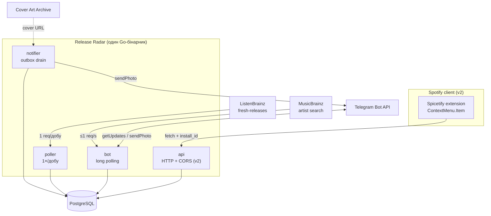
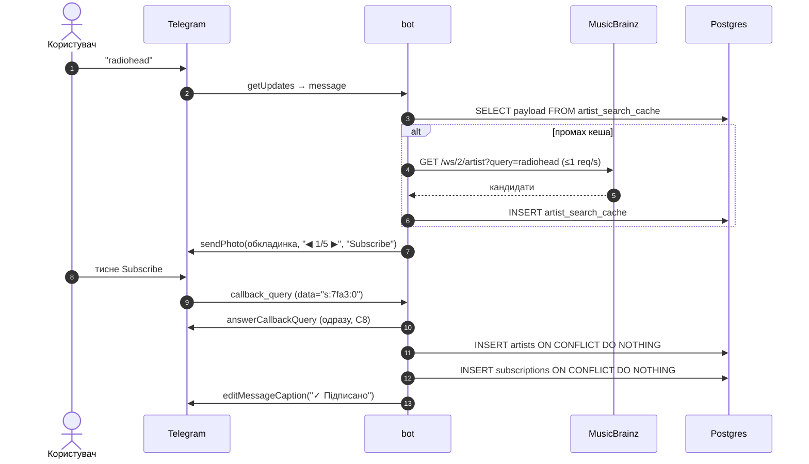

# Release Radar — специфікація

> Telegram-бот, що повідомляє про нові релізи артистів, на які підписався користувач.
> Мова: **Go**. БД: **PostgreSQL**. Джерело релізів: **ListenBrainz / MusicBrainz**.
> Статус: pre-code. Зафіксовано після research-раунду 19.08.2026.

Цей документ — джерело правди для проєкту. Кожне «чому саме так» тут записане навмисне:
більшість обмежень нижче були знайдені емпірично, і без них легко зробити рішення,
яке впаде через два тижні.

---

## 1. Зафіксовані рішення

| # | Рішення | Обґрунтування |
|---|---|---|
| D1 | Мова — **Go** | Задача = паралельні HTTP-виклики + планувальник + консьюмер черги. Sweet spot для горутин і `context`. Плюс цільова роль — junior backend |
| D2 | Джерело релізів — **ListenBrainz Fresh Releases** (чистий, без Spotify API) | Один запит на добу покриває всю екосистему замість N запитів на N артистів. Spotify Web API недоступний: **потрібен активний Premium власника app** (з лют. 2026), якого немає і не буде |
| D3 | Типи релізів — **album + single + EP** | Компроміс між покриттям і шумом. `appears_on` / `compilation` виключені |
| D4 | Порядок розробки — **бот у v1, Spicetify extension у v2** | Extension — єдина частина, яка ламається без участі автора. Не має бути в критичному шляху до працюючого продукту |
| D5 | Affordance в extension — **`Spicetify.ContextMenu.Item`**, не кнопка в хедері | Офіційний типізований API з URI-предикатом. Нуль DOM-хаків. Сам Spicetify пройшов цей шлях і відмовився від інжекту в хедер у 2019 |
| D6 | Лінкування Telegram — **deep link + обов'язковий код-fallback** | `?start=` payload ненадійно доходить для повторного лінкування (див. C4) |
| D7 | Ключ дедуплікації релізу — **`release_group_mbid`** | MusicBrainz release-*group* вже об'єднує всі видання одного альбому. Це структурно краще за Spotify `album.id`, який плодить регіональні дублі |
| D8 | Черга — **Postgres `SELECT … FOR UPDATE SKIP LOCKED`** (не RabbitMQ у v1) | Обсяг — сотні повідомлень/добу. Брокер додає ops-навантаження без виграшу. Див. Q-OPEN-1 |
| D9 | Redis — **немає** | Кешування перед перевіркою дедуплікації створює race condition і жодного виграшу не дає. Див. §8 |
| D10 | Telegram-бібліотека — **`mymmrac/telego`** | Bot API 10.2, єдина з вбудованою обробкою 429. `go-telegram-bot-api` (6.4k ★) мертва — останній коміт жовт. 2022 |
| D11 | `parse_mode` — **HTML** | MarkdownV2 вимагає екранування 18 символів за трьома контекстними правилами. У Go stdlib є `html.EscapeString`. MarkdownV2 гарантовано вб'ється на «Panic! At The Disco» |
| D12 | Отримання апдейтів — **long polling** | Telegram сам радить: *«You use getUpdates … keep it that way»*. Працює за NAT, без домену й TLS |
| D13 | **Канал доставки — плагін, не хардкод.** Таблиця `channels` + інтерфейс `Notifier` з першого коміту, навіть якщо реалізований лише Telegram | Дешево зараз, дорого потім. Email додається за вечір замість переписування домену. Обов'язкова умова: Telegram-специфічні типи (`chat_id`, `parse_mode`, `retry_after`) **не течуть** вище межі `Notifier` — домен каже «сповісти користувача U про реліз R» |
| D14 | **`cover_url` збирається `poller`-ом із полів відповіді, без жодного HTTP-виклику** | `caa_id` + `caa_release_mbid` уже є в payload (C27). Резолв у `notifier` дав би N запитів на N підписників; тут їх нуль. Заповнюється один раз при створенні релізу |
| D15 | **Вікно полінгу — `days=7&past=true&future=false`** при добовому інтервалі | Три причини тримати зворотне вікно ширшим за інтервал: (1) **пропущені полінги** — рестарт VPS, деплой, збій мережі; бекфілу немає, тож при `days=1` дводенний простій губить релізи безповоротно; (2) **лаг краудсорсингу** — `days` фільтрує за `release_date`, не за датою внесення (C24c), тому реліз від понеділка, внесений волонтером у середу, при вузькому вікні не з'явиться **ніколи**; (3) **перекриття безкоштовне** — `ON CONFLICT (release_group_mbid) DO NOTHING` робить повторне бачення релізу no-op. `future=false` прибирає майбутні релізи на джерелі й спрощує FR-2.5 |

**Незафіксоване** → §12 Open questions.

---

## 2. Функціональні вимоги

### FR-1 — Підписка через бота (v1)
- FR-1.1 `/start` без payload → вітання + інструкція.
- FR-1.2 `/search <name>` або просто текст → пошук артиста в MusicBrainz, показ до 5 кандидатів.
- FR-1.3 Кандидати показуються **однією карткою з пагінацією** (`sendPhoto` + `editMessageMedia`, `◀ 2/5 ▶` + `Subscribe`), а не 5 окремими повідомленнями.
- FR-1.4 Натискання `Subscribe` → створення підписки. Повторне натискання — no-op, не помилка.
- FR-1.5 `/list` → список підписок з кнопкою `Unsubscribe` біля кожної.
- FR-1.6 `/stop` → видалення всіх підписок і даних користувача.
- FR-1.7 Команди зареєстровані через `setMyCommands` (видимі в меню).

### FR-2 — Детекція релізів
- FR-2.1 Раз на добу опитувати `GET https://api.listenbrainz.org/1/explore/fresh-releases/?days=7&past=true&future=false`.
  **Не `days=3`, і не без `past`/`future`** — див. C24 і D15.
- FR-2.2 Матчити `artist_mbids` з відповіді проти множини відстежуваних MBID **локально** (сервер-сайд фільтра за артистом немає).
- FR-2.3 Фільтрувати за `release_group_primary_type ∈ {Album, Single, EP}`.
- FR-2.4 Новий реліз → запис у `releases` (разом із **одноразовим** резолвом `cover_url` через Cover Art Archive, див. D14); для кожного підписаного користувача → запис у `notifications`.
- FR-2.5 `future=false` відсікає майбутні релізи **на джерелі**, тому механіку «тримати `pending` до дати» будувати не потрібно:
  реліз природно підхопиться зворотним вікном, коли його дата настане. Перевірка `release_date > today`
  залишається як **захисний assert** (дешево, і API може змінитись), а не як несуча логіка.

### FR-3 — Доставка
- FR-3.1 Повідомлення містить: назву релізу, артиста, тип, дату, обкладинку (Cover Art Archive), посилання.
- FR-3.2 Темп надсилання дотримує лімітів Telegram (C3).
- FR-3.3 Транзієнтні помилки — retry з backoff. Постійні — видалення підписки (C5).
- FR-3.4 Один користувач отримує **рівно одне** повідомлення про один реліз, незалежно від того, скількома шляхами він підписався.

### FR-4 — Spicetify extension (v2)
- FR-4.1 Пункт контекстного меню на артисті: `Notify me about releases`.
- FR-4.2 Якщо користувач уже підписаний — показується `Stop notifying` замість `Notify me`.
  *Реалізація:* реєструються **два** `ContextMenu.Item` з різними `shouldAdd`-предикатами — офіційний API це дозволяє, динамічно змінювати label не потрібно.
- FR-4.3 Якщо Telegram не підключений — клік відкриває deep link на бота.
- FR-4.4 Якщо підключений — клік робить `fetch()` на бекенд, потім `Spicetify.showNotification("Subscribed")`.

### FR-5 — Управління списком у Spotify (v3, не планується зараз)
Окрема вкладка зі списком підписок — це **Custom App**, не extension. Інший рівень складності.

---

## 3. Нефункціональні вимоги

| # | Вимога | Як досягається |
|---|---|---|
| NFR-1 | **Жодних дублів повідомлень** | `UNIQUE(user_id, release_id)` + `INSERT … ON CONFLICT DO NOTHING` |
| NFR-2 | Пара user–artist унікальна | `PRIMARY KEY (user_id, artist_mbid)` у `subscriptions` |
| NFR-3 | Перезапуск сервісу не втрачає й не дублює повідомлення | Outbox-таблиця + `SKIP LOCKED`, стан у БД, не в пам'яті |
| NFR-4 | ≤1 msg/s на чат, ≤25 msg/s глобально | Token bucket у notifier. 25, не 30 — запас під ліміт |
| NFR-5 | MusicBrainz ≤1 req/s, осмислений `User-Agent` | Глобальний rate limiter + `ReleaseRadar/0.1 (email)` |
| NFR-6 | Один VPS, ~5 USD/міс | `docker compose`: app + postgres. Без k8s, без Redis |
| NFR-7 | Видалення даних на `/stop` або блокування | Обов'язок за Telegram ToS §4.2 |
| NFR-8 | Секрети не в коді | env vars, `.env` у `.gitignore` |
| NFR-9 | Спостережність | Структурні логи (`log/slog`), лічильники: polls, releases_found, notifications_sent/failed |
| NFR-10 | Розгортання відтворюване | Один `docker compose up`, міграції автоматом при старті |

---

## 4. Жорсткі обмеження (перевірені факти)

Це не «варто врахувати» — це те, у що проєкт вдариться, якщо проігнорувати.

### Telegram

- **C1. Бот не може написати за `@username`.** `sendMessage.chat_id` приймає `@username` тільки для **бота, супергрупи або каналу** — ніколи для приватного користувача. Потрібен числовий `chat_id`.
- **C2. Бот не може почати розмову першим.** Дослівно: *«Bots can't start conversations with users. A user must either add them to a group or send them a message first.»* Помилка: `403 Forbidden: bot can't initiate conversation with a user`.
- **C3. Ліміти:** ~1 msg/s на чат · **20 msg/min** у групі · **~30 msg/s глобально**. Порада Telegram для розсилок дослівно: *«consider spreading them over longer intervals (e.g. 8-12 hours)»*. Підняти ліміт можна тільки платно (`allow_paid_broadcast`, вимагає 100k Stars + 100k MAU — недосяжно).
- **C4. `?start=<payload>` ненадійний для повторного лінкування.** Для першого відкриття доходить. Для юзера, який уже має чат: на desktop показується кнопка START (payload піде лише після кліку), на iOS чат може відкритись і **не надіслати нічого**. Баг у Telegram-iOS відкритий з 2023: *«Different parameters on the same bot also fail after the first use.»* → **код-fallback обов'язковий**.
- **C5. Payload обмежений:** `A-Z a-z 0-9 _ -`, **до 64 символів**. 32 байти random у base64url = 43 символи → влазить.
- **C6. `callback_data` — 64 **байти**.** Імена артистів туди не влазять. Зберігати кандидатів на сервері, шле `s:7fa3:2`.
- **C7. `sendMediaGroup` не має `reply_markup` взагалі.** «5 обкладинок + 5 кнопок одним альбомом» технічно неможливо.
- **C8. `answerCallbackQuery` не опційний** — клієнт крутить спінер на кнопці, поки не відповіси. Відповідати **до** початку роботи.
- **C9. `error_code` нестабільний за документацією:** *«its contents are subject to change in the future»*. Матчити `error_code` + case-insensitive `strings.Contains(description, …)`, невідомі 403 вважати постійними.
- **C10. 429:** `retry_after` живе в `parameters`, не на верхньому рівні. Одиниці — секунди.
- **C11. 502 може прийти не-JSON HTML.** Декодер мусить це витримати.

### Spotify / Spicetify

- **C12. Spotify Web API недоступний з бекенду.** Client Credentials з лют. 2026 вимагає активного Premium у власника app: `Active premium subscription required for the owner of the app`. Premium немає → **жодних викликів `api.spotify.com` із сервера**.
- **C13. Dev mode = 5 авторизованих юзерів** (не 25). Extended Quota — **тільки організації з ≥250k MAU**, для фізособи закрито з 15.05.2025.
- **C14. Spotify dev app для extension НЕ потрібен.** Spicetify-extension — це просто JS у клієнті. Реєстрація в developer dashboard не потрібна взагалі.
- **C15. CSP у Spotify-клієнті немає** — звичайний `fetch()` на власний бекенд працює. Перевірено: 0 входжень `Content-Security-Policy` в `index.html` (і в бекапі, і в живому).
- **C16. CORS діє нормально.** Origin сторінки — `https://xpui.app.spotify.com`. Бекенд мусить віддавати `Access-Control-Allow-Origin` і обробляти `OPTIONS` preflight. `localhost`/`127.0.0.1` звільнені від mixed-content → локальна розробка без TLS.
- **C17. НЕ використовувати `Spicetify.CosmosAsync` для власного бекенду.** На Spotify ≥1.2.31 він тихо переписує зовнішні URL через **`https://cors-proxy.spicetify.app/{url}`** (сторонній Cloudflare Worker) і **викидає твої `headers`**. Офіційна документація: *«If you need to make a request to an external URL, use `fetch` instead.»*
- **C18. `data-testid` на сторінці артиста не існує** — Spotify вирізає **саму назву атрибута** в `xpui-modules.js`. Не працюють: `[data-testid="artist-page"]`, `[data-testid="action-bar-row"]`, `[data-testid="follow-button"]` (останнього не було ніколи). Працюють: `section[data-test-uri^="spotify:artist:"]`, `.main-actionBar-ActionBarRow`, `[data-encore-id="buttonSecondary"]`.
- **C19. 89% класів `artist-*` мертві** — 85 із 95 у css-map відсутні в живому клієнті. Сторінка артиста не має дружньо названого контейнера: її className — сирий хеш.
- **C20. Ніколи не прив'язуватись до кнопки Follow** — три несумісні ідентичності за три роки.
- **C21. Extension копіюється, не лінкується.** Правка джерела не діє, поки не `spicetify apply` / `spicetify watch -e`.
- **C22. Оновлення Spotify періодично ламає Spicetify цілком.** Spotify 1.2.78: 26 дублікатів issue за 3 тижні, вікно поломки ~11 днів. Spotify 1.2.86: офіційна порада мейнтейнерів — downgrade Spotify.
- **C23. Токен користувача доступний зсередини клієнта:** `Spicetify.Platform.AuthorizationAPI.getState().token.accessToken`. Це токен **самого користувача**, не app — Premium і dev app не потрібні. Але доступно **тільки в extension**, не в боті.

### ListenBrainz / MusicBrainz

- **C24. ListenBrainz `fresh-releases` — `days=N` це вікно ±N днів, а НЕ «останні N днів».** Перевірено емпірично 22.08.2026: `days=3` → релізи з 19.08 по **25.08** (7 днів, 850 записів, 29 із них у майбутньому); `days=1` → 21.08–23.08 (3 дні). Параметри **`past=true&future=false` працюють** і дають лише зворотну частину вікна (`days=3&past=true&future=false` → 19.08–22.08, майбутніх 0).
- **C24b. Пагінації немає, і вибірка не обрізається:** `total_count == len(releases) == 850`. Уся відповідь приходить одним тілом → фільтрувати локально. Серверного фільтра за артистом немає.
- **C24c. `days` фільтрує за `release_date`, а не за датою потрапляння запису в MusicBrainz.** Це головна причина тримати зворотне вікно ширшим за інтервал полінгу — див. D15.
- **C25. MusicBrainz — 1 req/s на IP** + обов'язковий осмислений `User-Agent`.
- **C25b. Реакція на `User-Agent` — дві різні.** *Порожній* UA → **403** із прозорим текстом: `Your requests are being throttled by MusicBrainz because the application you are using has not identified itself`. *Генеричний* UA (`curl/8.1.2`, `Go-http-client/1.1`) → **503** із туманним `The MusicBrainz web server is currently busy`. Жоден не лікується ретраєм → клієнт **відмовляється створюватись** без UA з контактною адресою.
- **C25c. 503 завжди транзієнтний і НЕ означає «нічого не знайдено».** Той самий 503 приходить за ліміт, за поганий UA і за реальне навантаження — з однаковим тілом, розрізнити неможливо. Перевірено: кожен побачений 503 дав 200 після 1–3 ретраїв. Нуль результатів — це чистий `200` з `count: 0`.
- **C34. MusicBrainz парсить Lucene-синтаксис із користувацького вводу.** Запит `artist:(foo OR bar) AND ][` віддає **275 020** нерелевантних результатів. Спецсимволи `+-&|!(){}[]^"~*?:\/` треба екранувати, інакше назва з дужкою чи двокрапкою дає сміття. Після екранування перевірено на живому API: `AC/DC`→AC/DC(100), `Sunn O)))`→Sunn O)))(100), `][`→ гурт «][»(100), `artist:radiohead`→Radiohead(100).
- **C26. Дані краудсорсні** — можуть відставати від Spotify на години-дні. SLA немає. Це прийнята ціна рішення D2.
- **C32. У MusicBrainz НЕМАЄ зображень артистів.** Cover Art Archive покриває релізи й release-групи, не артистів. Тому пікер артистів — **текстова картка, не фото**. Це не втрата: `score`, `type`, `country`, `life-span`, `disambiguation` і теги-жанри розрізняють однойменних артистів **краще за фото** — і саме цього бракувало Spotify після видалення `followers`/`popularity` (C6).
- **C35. Колонка `jsonb` переформатовує збережений JSON** (`["one","two"]` повертається як `["one", "two"]`) і не зберігає порядок ключів. Порівнювати payload побайтово не можна — тільки семантично.
- **C27. Обкладинка приходить у самій відповіді `fresh-releases` — окремий виклик Cover Art Archive НЕ потрібен.** Кожен реліз має `caa_id` + `caa_release_mbid`, з яких URL збирається рядком: `https://coverartarchive.org/release/<caa_release_mbid>/front-250` (перевірено: `200 image/jpeg`). Ми цей URL **не завантажуємо** — передаємо в `sendPhoto`, і картинку тягне Telegram.
- **C27b. У 26% релізів обкладинки немає взагалі.** Виміряно: `caa_id` присутній у 629 із 850. Фолбек обов'язковий → `sendMessage` замість `sendPhoto`.

### Юридичне

- **C28. Spotify Developer Policy §III.9** — *«Do not build an SDA that enables the transfer of data to another service»* — забороняє пересилання Spotify-даних у Telegram **на будь-якому масштабі**. Рішення D2 (ListenBrainz як джерело) знімає це: у Telegram їдуть дані MusicBrainz (CC0), не Spotify.
- **C29. Telegram ToS §5(b)** — заборона unsolicited-повідомлень. Підписка через `/start` = дозвіл. Зберігати, коли й як створена кожна підписка.
- **C30. Telegram ToS §4.2** — видаляти дані користувача на запит і коли зберігання стає непотрібним.
- **C31. Spicetify — сіра зона консумерських умов Spotify.** Підтверджених банів за косметичні модифікації не знайдено; за adblock/premium-unlock — репорти є. Adblock-екстеншени в цьому проєкті не використовуються.

---

## 5. Архітектура

Один бінарник, чотири воркери в горутинах. Не мікросервіси — розділення логічне, не мережеве.



| Компонент | Відповідальність |
|---|---|
| `bot` | Long polling, команди, пошук артистів, callback-и, `my_chat_member`, редемпція токенів лінкування |
| `poller` | Раз на добу тягне ListenBrainz, матчить проти `artists`, наповнює `releases` і `notifications` |
| `notifier` | Дренує `notifications` через `SKIP LOCKED`, тримає темп, ретраїть, класифікує помилки |
| `api` | **v2.** REST для extension: лінкування, CRUD підписок, resolve Spotify ID → MBID |

---

## 6. Схема БД

```sql
-- Користувач = один Telegram-чат
CREATE TABLE users (
    id              BIGSERIAL PRIMARY KEY,
    telegram_chat_id BIGINT NOT NULL UNIQUE,   -- числовий, не @username (C1)
    telegram_username TEXT,                    -- лише для відображення, НЕ для надсилання
    locale          TEXT NOT NULL DEFAULT 'uk',
    created_at      TIMESTAMPTZ NOT NULL DEFAULT now(),
    blocked_at      TIMESTAMPTZ                -- заповнюється з my_chat_member / 403
);

-- Артист, канонічний ключ — MusicBrainz MBID
CREATE TABLE artists (
    mbid            UUID PRIMARY KEY,
    name            TEXT NOT NULL,
    spotify_id      TEXT UNIQUE,               -- NULL, поки не змапили (v2)
    resolved_at     TIMESTAMPTZ,               -- коли останній раз мапили spotify_id
    created_at      TIMESTAMPTZ NOT NULL DEFAULT now()
);
CREATE INDEX idx_artists_spotify ON artists (spotify_id) WHERE spotify_id IS NOT NULL;

-- NFR-2: пара user–artist унікальна за конструкцією
CREATE TABLE subscriptions (
    user_id         BIGINT NOT NULL REFERENCES users(id) ON DELETE CASCADE,
    artist_mbid     UUID   NOT NULL REFERENCES artists(mbid) ON DELETE CASCADE,
    source          TEXT   NOT NULL CHECK (source IN ('bot','extension')),
    created_at      TIMESTAMPTZ NOT NULL DEFAULT now(),
    PRIMARY KEY (user_id, artist_mbid)
);
CREATE INDEX idx_subs_artist ON subscriptions (artist_mbid);

-- D7: release_group_mbid уже об'єднує всі видання одного альбому
CREATE TABLE releases (
    id                 BIGSERIAL PRIMARY KEY,
    release_group_mbid UUID NOT NULL UNIQUE,
    artist_mbid        UUID NOT NULL REFERENCES artists(mbid),
    title              TEXT NOT NULL,
    primary_type       TEXT NOT NULL,          -- Album | Single | EP
    release_date       DATE NOT NULL,
    cover_url          TEXT,
    dedup_key          TEXT NOT NULL UNIQUE,   -- фолбек: artist_mbid|normalize(title)|release_date
    first_seen_at      TIMESTAMPTZ NOT NULL DEFAULT now()
);

-- Outbox. NFR-1 + NFR-3
CREATE TABLE notifications (
    id              BIGSERIAL PRIMARY KEY,
    user_id         BIGINT NOT NULL REFERENCES users(id) ON DELETE CASCADE,
    release_id      BIGINT NOT NULL REFERENCES releases(id) ON DELETE CASCADE,
    state           TEXT NOT NULL DEFAULT 'pending'
                    CHECK (state IN ('pending','sent','failed','skipped')),
    attempts        INT NOT NULL DEFAULT 0,
    next_attempt_at TIMESTAMPTZ NOT NULL DEFAULT now(),
    last_error      TEXT,
    sent_at         TIMESTAMPTZ,
    UNIQUE (user_id, release_id)               -- <<< NFR-1: гарантія «один раз»
);
CREATE INDEX idx_notif_claim ON notifications (next_attempt_at)
    WHERE state = 'pending';

-- Токени лінкування (D6). Зберігаємо тільки хеш
CREATE TABLE link_tokens (
    token_hash  BYTEA PRIMARY KEY,             -- sha256(token)
    short_code  TEXT NOT NULL UNIQUE,          -- fallback: 6 символів для ручного введення
    install_id  TEXT NOT NULL,                 -- ідентифікатор інсталяції extension
    created_at  TIMESTAMPTZ NOT NULL DEFAULT now(),
    expires_at  TIMESTAMPTZ NOT NULL,
    redeemed_at TIMESTAMPTZ,
    user_id     BIGINT REFERENCES users(id) ON DELETE CASCADE
);

-- Прив'язка інсталяції extension до користувача (v2, авторизація для API)
CREATE TABLE installs (
    install_id  TEXT PRIMARY KEY,
    user_id     BIGINT NOT NULL REFERENCES users(id) ON DELETE CASCADE,
    linked_at   TIMESTAMPTZ NOT NULL DEFAULT now(),
    last_seen_at TIMESTAMPTZ
);

-- Кеш пошуку артистів (§8) — MusicBrainz 1 req/s
CREATE TABLE artist_search_cache (
    query       TEXT PRIMARY KEY,              -- lower(trim(query))
    payload     JSONB NOT NULL,                -- кандидати
    fetched_at  TIMESTAMPTZ NOT NULL DEFAULT now()
);

-- Стан поллера, щоб не повторювати вікно після перезапуску
CREATE TABLE poll_state (
    source        TEXT PRIMARY KEY,            -- 'listenbrainz'
    last_polled_at TIMESTAMPTZ,
    last_ok_at    TIMESTAMPTZ,
    last_error    TEXT
);

-- D13: канал доставки — плагін. У v1 реалізований лише 'telegram'
CREATE TABLE channels (
    id          BIGSERIAL PRIMARY KEY,
    user_id     BIGINT NOT NULL REFERENCES users(id) ON DELETE CASCADE,
    kind        TEXT   NOT NULL CHECK (kind IN ('telegram','email','whatsapp')),
    address     TEXT   NOT NULL,               -- chat_id / email / phone
    verified_at TIMESTAMPTZ,
    disabled_at TIMESTAMPTZ,                   -- заблокував бота / bounce
    created_at  TIMESTAMPTZ NOT NULL DEFAULT now(),
    UNIQUE (user_id, kind, address)
);
```

> **Примітка про `users.telegram_chat_id` vs `channels`.** У v1 обидва існують:
> `users.telegram_chat_id` — робочий шлях, `channels` — межа абстракції. Коли з'явиться
> другий канал, `telegram_chat_id` переїжджає в `channels` міграцією, а домен уже
> написаний так, що цього не помітить. Не робити навпаки: додати `channels` пізніше
> означає переписати `notifier` цілком.

### Чому саме ці два UNIQUE вирішують задачу дедуплікації

Користувач у першому описі хотів: «*пара user-artist повинна бути унікальною і не може повторюватись*».

- `subscriptions PRIMARY KEY (user_id, artist_mbid)` — підписка з бота і з extension фізично не можуть створити дубль. `INSERT … ON CONFLICT DO NOTHING` — і не потрібна жодна перевірка «а чи вже є».
- `notifications UNIQUE (user_id, release_id)` — навіть якщо поллер випадково відпрацює двічі за одне вікно, друга вставка тихо відпаде. **Це і є гарантія «одне повідомлення на один реліз», а не логіка в коді.**

---

## 7. API endpoints (v2, для extension)

Базовий шлях `/v1`. Авторизація — `Authorization: Bearer <install_id>` (32 байти random, видається при лінкуванні).
CORS: `Access-Control-Allow-Origin: https://xpui.app.spotify.com`, `OPTIONS` → 204 (C16).

| Метод | Шлях | Тіло / параметри | Відповідь | Призначення |
|---|---|---|---|---|
| `POST` | `/link/init` | `{"install_id":"…"}` | `{"deep_link":"https://t.me/bot?start=…","short_code":"K7F2QX","expires_at":"…"}` | Створити токен лінкування. **Не** вимагає авторизації |
| `GET` | `/me` | — | `{"linked":true,"telegram_username":"@yurii","subscription_count":12}` | Стан для рендеру UI |
| `GET` | `/me/subscriptions` | — | `[{"mbid":"…","name":"Radiohead","spotify_id":"4Z8W4…"}]` | Множина для `shouldAdd`-предикатів (FR-4.2) |
| `POST` | `/subscriptions` | `{"spotify_artist_id":"4Z8W4…","name":"Radiohead"}` | `201` / `200` якщо вже є | Підписка з extension |
| `DELETE` | `/subscriptions/{mbid}` | — | `204` | Відписка |
| `GET` | `/resolve/spotify/{artist_id}` | — | `200 {"mbid":"…"}` або `404 {"candidates":[…]}` | Мапінг Spotify ID → MBID |
| `GET` | `/healthz` | — | `200 {"status":"ok","db":"ok"}` | Health check |

**Формат помилок** — однаковий усюди:
```json
{"error": {"code": "not_linked", "message": "Telegram is not connected yet"}}
```
Коди: `not_linked` · `invalid_token` · `token_expired` · `artist_not_resolved` · `rate_limited` · `internal`.

### Найризикованіший ендпоінт — `/resolve/spotify/{id}`

У v1 цієї проблеми **немає взагалі**: у боті користувач шукає за назвою, MusicBrainz одразу віддає MBID.
Проблема виникає лише у v2, бо extension знає тільки Spotify ID.

Шлях резолву:
1. `SELECT mbid FROM artists WHERE spotify_id = $1` — кеш.
2. MusicBrainz URL-relationship: `GET /ws/2/url?resource=https://open.spotify.com/artist/<id>&inc=artist-rels&fmt=json`.
3. Якщо зв'язку немає (покриття краудсорсне, часткове) → пошук за назвою, повернути `404` з кандидатами, і **користувач підтверджує вибір**. Ніколи не вгадувати молча.

---

## 8. Кешування — і чому Redis тут шкідливий

### Питання, яке треба перевернути

Інстинкт «*воркер спочатку подивиться в Redis, чи немає запису про реліз, а потім у БД*» —
для цього шляху **неправильний**. Причина: перевірка «чи ми вже повідомили» — це не читання, а **рішення про запис**.

Кеш перед нею створює вікно, у якому два воркери обидва бачать «нема» і обидва надсилають.
Тобто кеш тут не пришвидшує, а **вносить баг**, який неможливо відтворити локально.

Правильний спосіб — не перевіряти, а дати БД відмовити:
```sql
INSERT INTO notifications (user_id, release_id)
VALUES ($1, $2)
ON CONFLICT (user_id, release_id) DO NOTHING;
```
Атомарно, ідемпотентно, без гонок, без Redis. Одна операція замість «прочитати → подумати → записати».

### Де кеш справді потрібен

| Що | Де | TTL | Чому |
|---|---|---|---|
| Пошук артистів у MusicBrainz | Таблиця `artist_search_cache` | 7 днів | MusicBrainz — **1 req/s** (C25). Ті самі популярні запити повторюються |
| Мапінг `spotify_id → mbid` | Колонка `artists.spotify_id` | назавжди | Резолв дорогий, результат не змінюється |
| URL обкладинки | Колонка `releases.cover_url` | назавжди | Cover Art Archive не треба питати двічі |
| `file_id` завантаженої в Telegram картинки | (v2) колонка в `releases` | назавжди | Telegram радить перевикористовувати `file_id` — швидше й без повторного завантаження |
| Множина відстежуваних MBID | In-process, `map[uuid]struct{}` | перезбирається щопоління | Матчинг ListenBrainz-відповіді — гарячий цикл, у БД по одному ходити безглуздо |

**Висновок: Redis у v1 не потрібен.** Постгрес — це і є кеш на цьому масштабі.
Redis з'явиться, тільки якщо notifier запуститься в кілька інстансів і token bucket
доведеться зробити спільним. Це не станеться на одному VPS.

---

## 9. Ключові потоки

### 9.1 Підписка через бота (v1, головний шлях)



### 9.2 Детекція релізів і fan-out

```mermaid
sequenceDiagram
    autonumber
    participant P as poller
    participant LB as ListenBrainz
    participant PG as Postgres
    participant N as notifier
    participant TG as Telegram

    Note over P: раз на добу
    P->>LB: GET /1/explore/fresh-releases/?days=3
    LB-->>P: усі релізи вікна (без фільтра за артистом, C24)
    P->>PG: SELECT mbid FROM artists → множина в пам'ять
    Note over P: локальний матчинг + фільтр типів (FR-2.3)
    P->>PG: INSERT releases ON CONFLICT (release_group_mbid) DO NOTHING
    P->>PG: INSERT notifications … ON CONFLICT (user_id, release_id) DO NOTHING
    loop поки є pending
        N->>PG: SELECT … FOR UPDATE SKIP LOCKED LIMIT 20
        N->>TG: sendPhoto (темп: ≤1/s на чат, ≤25/s всього)
        alt 200 OK
            N->>PG: state='sent', sent_at=now()
        else 429
            N->>PG: next_attempt_at = now() + retry_after
        else 403 blocked
            N->>PG: DELETE subscriptions; users.blocked_at=now()
        end
    end
```

### 9.3 Лінкування Telegram з extension (v2)

```mermaid
sequenceDiagram
    autonumber
    actor U as Користувач
    participant E as extension
    participant A as api
    participant PG as Postgres
    participant B as bot

    Note over E: перший запуск
    E->>E: install_id = random(32B) → Spicetify.LocalStorage
    U->>E: правий клік на артисті → "Notify me"
    E->>A: POST /v1/link/init {install_id}
    A->>PG: INSERT link_tokens (hash, short_code, expires 15 min)
    A-->>E: {deep_link, short_code}
    E->>U: PopupModal: кнопка "Відкрити бота" + код K7F2QX
    alt deep link спрацював
        U->>B: /start <token>
    else deep link проглючив (C4)
        U->>B: вручну надсилає K7F2QX
    end
    B->>PG: перевірка hash/code, TTL, not redeemed
    B->>PG: INSERT users; INSERT installs (install_id → user_id)
    B->>PG: UPDATE link_tokens SET redeemed_at
    B->>U: "✅ Spotify підключено"
    Note over E: наступний виклик уже авторизований
    E->>A: GET /v1/me/subscriptions (Bearer install_id)
```

### 9.4 Як extension показує стан підписки (відповідь на питання про синхронізацію)

Проблема: після підписки в боті Spotify не знає про це, і пункт меню показував би неправильне.

Рішення — **extension тримає локальну копію множини підписок і оновлює її з бекенду**:

1. При старті: `GET /v1/me/subscriptions` → зберегти в `Spicetify.LocalStorage` як `releaseRadar:subs`.
2. Зареєструвати **два** пункти контекстного меню з різними предикатами:
   ```js
   const subs = new Set(JSON.parse(Spicetify.LocalStorage.get("releaseRadar:subs") || "[]"));
   const idOf = (uri) => Spicetify.URI.from(uri)?.id;

   new Spicetify.ContextMenu.Item("Notify me about releases", onSubscribe,
       (uris) => Spicetify.URI.isArtist(uris[0]) && !subs.has(idOf(uris[0])), "bell").register();

   new Spicetify.ContextMenu.Item("Stop notifying", onUnsubscribe,
       (uris) => Spicetify.URI.isArtist(uris[0]) &&  subs.has(idOf(uris[0])), "bell-active").register();
   ```
   `shouldAdd` викликається щоразу при відкритті меню — тому достатньо тримати `Set` актуальним, динамічно міняти label не потрібно.
3. Після успішного `POST`/`DELETE` — оновити `Set` і `LocalStorage` **оптимістично**, не чекаючи повторного `GET`.
4. Ре-синк: при старті клієнта і не частіше разу на N хвилин. Bot → extension push не потрібен.

**Це вимагає варіанту A (`fetch` на бекенд), який підтверджено робочим (C15).**
У v1 (варіант B — лише deep link) стану не буде, і це усвідомлена тимчасова втрата.

---

## 10. Пейсинг і обробка помилок Telegram

```
token bucket: 25 msg/s глобально (запас під 30)
              + 1 msg/s на chat_id
retry:        експоненційний backoff 1m → 5m → 30m → 2h → 12h, максимум 5 спроб
```

| Клас | Умова | Дія |
|---|---|---|
| **Постійна** | `403 … bot was blocked by the user` | видалити підписки, `blocked_at` |
| **Постійна** | `403 … user is deactivated` | видалити користувача |
| **Постійна** | `403 … bot can't initiate conversation` | видалити — само не полікується |
| **Постійна** | `400 … chat not found` | видалити |
| **Транзієнтна** | `429` | спати `parameters.retry_after` |
| **Транзієнтна** | `5xx` | backoff (тіло може бути HTML, C11) |
| **Наш баг** | `400 … can't parse entities` | `state='failed'`, **підписку не чіпати** |
| **Глобальна** | `401 Unauthorized` | алярм. **Ніколи не видаляти підписки** |

Проактивна детекція блокування: апдейт `my_chat_member` для приватних чатів приходить
саме при block/unblock, і **за замовчуванням увімкнений**. Це дешевше, ніж чекати 403.

---

## 11. Етапи розробки

Кожен етап — це щось, що **працює і його можна показати**. Ніяких «спочатку напишу всі шари».

| # | Етап | Обсяг | Definition of done |
|---|---|---|---|
| **S0** | Скелет | `docker compose` (app+postgres), міграції, `/healthz`, structured logging | `docker compose up` піднімає все, health віддає 200 |
| **S1** | Бот відповідає | telego, long polling, `/start`, `setMyCommands`, `my_chat_member`, upsert користувача | **ВИКОНАНО 28.08.2026.** Бот відповідає на `/start` (`music_release_radar_bot`, id 8656106994). Ідемпотентність підтверджена живими даними: два `/start` → `user_id=32` обидва рази, один рядок у `users` |
| **S2** | Пошук артиста | MusicBrainz + лімітер 1 req/s + ретрай 503 + екранування Lucene + `artist_search_cache` (міграція 0002) + картка з пагінацією | **ВИКОНАНО 28.08.2026.** `radiohead` → 5 кандидатів, перемикання ◀ ▶. **Без обкладинок** — їх у MusicBrainz немає (C32) |
| **S3** | Підписки | `subscriptions`, `INSERT … ON CONFLICT`, `/list`, `Unsubscribe`, `/stop` | Підписка створюється, повторна — no-op, список працює |
| **S4** | Детекція релізів | ListenBrainz poller, матчинг, `releases`, фільтр типів, guard `release_date > today` | Ручний тригер поллера знаходить релізи для підписаних артистів |
| **S5** | Доставка | outbox + `SKIP LOCKED`, token bucket, таблиця помилок, `my_chat_member` | Повідомлення приходить рівно раз. Ручний блок бота → підписки видаляються |
| **S6** | Продакшн | VPS, systemd/compose restart, бекап Postgres, метрики | Живе тиждень без ручного втручання |
| — | **← v1 готова.** Далі — extension | | |
| ~~**S7**~~ | ~~Extension: спайк~~ | **ПРОЙДЕНО 23.08.2026.** `fetch()` з extension дійшов до Go-сервера: `OPTIONS` preflight → `POST`, `origin=https://xpui.app.spotify.com`, Chromium UA (не curl), `artist_id=73VoAnPGod8PX4FTfoZ8Yl`. `ContextMenu.Item` зареєструвався на артисті, і two-predicate патерн перемкнув пункт на «Stop notifying» після підписки | **C15/C16 і D5/FR-4.2 підтверджені на цій машині. Варіант A життєздатний** |
| **S8** | API + лінкування | `/link/init`, редемпція в боті, `installs`, CORS | Extension лінкується, `/me` віддає `linked:true` |
| **S9** | Підписка з Spotify | `/resolve/spotify/{id}`, `POST /subscriptions`, два пункти меню зі станом | Правий клік на артисті → підписка → пункт меню змінився |
| **S10** | Публікація extension | README, скріншот, topic `spicetify-extensions` | Встановлюється через `spicetify config extensions` |

**Спайк S7 варто зробити раніше** — після S1, паралельно. Він дешевий і зніме останню невизначеність.

---

## 12. Open questions

| # | Питання | Стан |
|---|---|---|
| ~~Q-OPEN-1~~ | ~~Брокер~~ | **ВИРІШЕНО 22.08.2026 → D8.** Postgres `SKIP LOCKED` у v1. RabbitMQ — усвідомлена окрема міграція у v2, з власною історією «чому і коли я переїхав». Тримати чергу за інтерфейсом, щоб заміна була локальною |
| **Q-OPEN-2** | Масштаб: «для себе + друзі» чи публічно? | Прийнято як «друзі, архітектурно готово до ~1000». Потребує підтвердження |
| **Q-OPEN-3** | Веб-сайт з мультиканальними нотифікаціями (email / WhatsApp) | Див. §13 |
| **Q-OPEN-4** | Хостинг: який саме VPS / провайдер | Не обговорено |
| **Q-OPEN-5** | Наскільки великий лаг ListenBrainz на практиці? | Невідомо. Виміряти на S4: порівняти дату появи в ListenBrainz із фактичною датою релізу |

---

## 13. Розглянуті й відкинуті альтернативи

| Альтернатива | Чому відкинуто |
|---|---|
| **Spotify API як джерело релізів** | Потрібен Premium власника app (C12). Плюс N запитів на N артистів, недоступна квота, риск 24-годинного блоку за один 429, і ToS §III.9 (C28) |
| **`GET /me/following`** — імпорт того, кого юзер уже фоловить | Єдиний ендпоінт, який затягує в ліміт 5 юзерів (C13). Вимагає user OAuth |
| **Release Radar плейлист Spotify** | Алгоритмічний плейлист, заблокований для app без extended quota — 404 |
| **Кнопка в хедері біля Follow** | 89% класів `artist-*` мертві (C19), testid вирізаний (C18), Follow має 3 ідентичності (C20). Сам Spicetify відмовився від цього підходу у 2019 |
| **`Spicetify.CosmosAsync`** для власного API | Проксіює через сторонній Cloudflare Worker і викидає headers (C17) |
| **`go-telegram-bot-api`** (найпопулярніша) | Мертва: останній коміт жовт. 2022, Bot API ~6.0 |
| **MarkdownV2** | 18 символів екранування за трьома контекстними правилами |
| **Webhook замість long polling** | Потрібен домен + TLS + один із портів 443/80/88/8443. Telegram сам радить long polling |
| **`spicetify-creator`** для збірки extension | Офіційно deprecated: *«should not be used … won't be receiving any more updates»* |
| **`spcr-settings`** для налаштувань | DOM-скрейпить хардкоджені селектори Spotify + `ReactDOM.render` з React 17 |
| **Redis перед перевіркою дедуплікації** | Вносить race condition, не пришвидшує (§8) |
| **Веб-сайт з мультиканальними нотифікаціями** | Це інший проєкт: фронтенд + сесійна авторизація + email-провайдер + WhatsApp Business API (вимагає верифікації бізнесу). **Але абстракцію каналу взято** — див. D13. Опція збережена дешево, без фронтенду |

---

## 16. Журнал змін специфікації

| Дата | Зміна |
|---|---|
| 19.08.2026 | Первинна версія після research-раунду (D1–D12, C1–C31) |
| 28.08.2026 | **S2 реалізовано.** Клієнт MusicBrainz із глобальним лімітером 1 req/s, ретраєм 503 і **екрануванням Lucene** (C34 — без нього назва з дужкою давала 275k сміття). Кеш пошуку + міграція `0002`: `callback_data` обмежений 64 байтами, тож кнопка несе 12-hex хендл, а не текст запиту. Пікер — **текстова картка**, бо обкладинок артистів не існує (C32). Нові обмеження: C25b (403 vs 503 за UA), C25c (503 завжди транзієнтний), C35 (`jsonb` переформатовує payload) |
| 28.08.2026 | **Процес змінено: тільки гілки й PR, `main` без прямих пушів.** Додано CI (lint / test з живим Postgres / build / docker build / spike), `golangci-lint` з 25 лінтерами запінений на v1.64.8 синхронно з локальним. **`depguard` тепер машинно стежить за межею `Notifier`** (D13) — імпорт `telego` поза `internal/telegram` валить CI; перевірено негативним тестом. Тести самі застосовують міграції, тож у CI вони **не скіпаються** (є окремий крок, що валить білд, якщо скіпнулись). Виправлено реальний баг: `os.Exit` у `TestMain` пропускав `defer` |
| 28.08.2026 | **S1 реалізовано.** `internal/telegram` одразу як реалізація `notify.Notifier` (не «голий» бот-воркер) — щоб не було спокуси покликати `SendMessage` з домену. Класифікація помилок Bot API → `notify.Disposition` покрита 20 тестами; окремо зафіксовано, що **401 не є permanent** (інакше один поганий деплой вичистив би всі підписки). `errgroup` для воркерів. `UpsertUser` через `ON CONFLICT` з очищенням `blocked_at` — це і є шлях розблокування |
| 23.08.2026 | **S7 пройдено на живому клієнті** — `fetch()` з extension і `ContextMenu.Item` працюють, two-predicate патерн перемикає пункт меню. Варіант A підтверджено. Порт БД на хості перенесено на **5433** (5432 зайнятий нативним PostgreSQL-сервісом). Module path → `github.com/Yurii-Levchenko/music-release-notifier` |
| 22.08.2026 | **D15** вікно полінгу `days=7&past=true&future=false`; **C24** виправлено — `days=N` це ±N днів, а не «останні N»; **C24b/C24c** пагінації немає, фільтр за `release_date` а не за датою внесення; **C27** обкладинка вже в payload, виклик CAA не потрібен; **C27b** у 26% релізів обкладинки немає; **D14** переформульовано (нуль HTTP-викликів); FR-2.1 і FR-2.5 спрощено. Джерело: живі запити до API |
| 22.08.2026 | **D13** канал як плагін (`channels` + `Notifier`); **D14** обкладинку резолвить `poller`, не `notifier` (знайдено при малюванні діаграми: інакше N запитів до CAA замість одного); Q-OPEN-1 закрито на користь Postgres `SKIP LOCKED`; додано таблицю `channels` і примітку про міграцію `telegram_chat_id` |

> **Правило.** Специфікація оновлюється **тим самим комітом**, що й зміна в коді.
> Спека, яка відстала від коду, гірша за відсутність спеки — вона бреше з виглядом істини.

---

## 14. Пам'ятки для середовища розробки

```bash
# Extensions лежать ТУТ (Roaming, не Local):
#   C:\Users\levch\AppData\Roaming\spicetify\Extensions\
# Local\spicetify — це каталог бінарника, не конфігу

spicetify config extensions releaseRadar.js   # ДОДАЄ (не замінює)
spicetify config extensions releaseRadar.js-  # видалити (трейлінг "-")
spicetify apply
spicetify watch -e                            # live-refresh при правках
```

- Увімкнути DevTools: `always_enable_devtools = 1` у `config-xpui.ini` (зараз `0`).
- Готовність Spicetify: `Spicetify.Events.platformLoaded.on(main)` — краще за `setTimeout`-поллінг.
- Типи: `/// <reference path="C:/Users/levch/AppData/Local/spicetify/globals.d.ts" />`.
- Збірка extension: власний esbuild config, IIFE, `Spicetify.React`/`ReactDOM` як external globals.
- Після **кожного** оновлення Spotify: `spicetify backup apply`.

---

## 15. Глосарій

| Термін | Значення |
|---|---|
| **MBID** | MusicBrainz Identifier, UUID. Канонічний ключ артиста в цьому проєкті |
| **release group** | Сутність MusicBrainz, що об'єднує всі видання одного альбому (CD, вініл, ремастер, регіональні версії). Основа дедуплікації |
| **outbox** | Таблиця `notifications` як черга: запис створюється в тій самій транзакції, що й реліз, потім дренується окремим воркером |
| **install_id** | Випадковий 32-байтовий ідентифікатор інсталяції extension. Слугує bearer-токеном для API |
| **short_code** | 6-символьний код для ручного лінкування, коли deep link проглючив |
| **xpui** | Назва бандла UI Spotify-клієнта (`xpui.spa`). Те, що патчить Spicetify |
| **Encore** | Дизайн-система Spotify. Кнопки мають `data-encore-id` |
